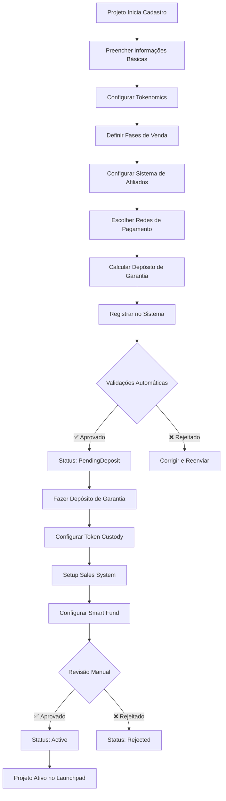

# 🚀 Fluxo Completo de Cadastro de Projeto - Sistema Integrado

## 📋 Visão Geral

O fluxo de cadastro de projeto foi **completamente atualizado** e integrado com todos os sistemas implementados: Token Custody, Smart Fund Treasury e Sistema Multi-Chain de Vendas.

## 🔄 Fluxo Completo Atualizado

### **Diagrama do Processo**


## 📝 Etapa 1: Informações Básicas do Projeto

### **Interface de Cadastro**
```
🚀 CADASTRO DE PROJETO - ETAPA 1/6

📋 INFORMAÇÕES BÁSICAS
├── Nome do Projeto: [Input] *obrigatório
├── Descrição: [Textarea] *obrigatório (min 10 chars)
├── Website: [URL Input]
├── Whitepaper: [URL Input]
├── Social Links:
│   ├── Twitter: [Input]
│   ├── Telegram: [Input]
│   ├── Discord: [Input]
│   └── Medium: [Input]
└── [Próximo: Tokenomics]
```

### **Validações Automáticas**
```rust
// Validações da Etapa 1
fn validate_basic_info(project_data: &ProjectCreate) -> Result<()> {
    ✅ Nome: 1-200 caracteres
    ✅ Descrição: 10-5000 caracteres
    ✅ Website: URL válida (opcional)
    ✅ Whitepaper: URL válida (opcional)
    ✅ Social links: URLs válidas (opcional)
}
```

## 💰 Etapa 2: Configuração de Tokenomics

### **Interface de Tokenomics**
```
💰 TOKENOMICS - ETAPA 2/6

🪙 INFORMAÇÕES DO TOKEN
├── Nome do Token: [Input] *obrigatório
├── Símbolo: [Input] *obrigatório (max 10 chars)
├── Supply Total: [Number] *obrigatório
├── Decimais: [Number] (padrão: 18)
├── Preço por Token (USD): [Number] *obrigatório
└── Token Address: [Input] *obrigatório

📊 DISTRIBUIÇÃO DE TOKENS
├── Venda Total: [Number]% (calculado automaticamente)
├── Airdrop: [Number]% (padrão: 10%)
├── Equipe: [Number]% (padrão: 20%)
├── Liquidez: [Number]% (padrão: 15%)
└── Reserva: [Number]% (restante)

[Próximo: Fases de Venda]
```

### **Cálculos Automáticos**
```rust
// Cálculos automáticos de tokenomics
TokenomicsCalculation {
    total_supply: 1_000_000_000,        // 1B tokens
    price_per_token_usd: 1_000_000,     // $0.001
    total_raise_target: 400_000_000_000, // $400k
    
    // Distribuição automática
    sale_allocation: 400_000_000,       // 40% para vendas
    airdrop_allocation: 100_000_000,    // 10% para airdrop
    team_allocation: 200_000_000,       // 20% para equipe
    liquidity_allocation: 150_000_000,  // 15% para liquidez
    reserve_allocation: 150_000_000,    // 15% reserva
}
```

## 📅 Etapa 3: Definir Fases de Venda

### **Interface de Fases**
```
📅 FASES DE VENDA - ETAPA 3/6

🎯 WHITELIST PHASE
├── ☑️ Ativar Whitelist
├── Data Início: [DateTime Picker]
├── Data Fim: [DateTime Picker]
├── Máx Participantes: [Number] (opcional)
├── Tokens Alocados: [Number]
└── Preço: [Number] USD por token

🚀 PRESALE PHASE
├── ☑️ Ativar Presale
├── Data Início: [DateTime Picker]
├── Data Fim: [DateTime Picker]
├── Máx Participantes: [Number] (opcional)
├── Tokens Alocados: [Number]
└── Preço: [Number] USD por token

🌐 PUBLIC SALE PHASE
├── ☑️ Ativar Public Sale
├── Data Início: [DateTime Picker]
├── Data Fim: [DateTime Picker]
├── Tokens Alocados: [Number]
└── Preço: [Number] USD por token

[Próximo: Sistema de Afiliados]
```

### **Validações de Fases**
```rust
// Validações automáticas das fases
fn validate_phases(phases: &ProjectPhases) -> Result<()> {
    ✅ Datas em ordem cronológica
    ✅ Não há sobreposição de datas
    ✅ Soma de tokens não excede alocação de venda
    ✅ Preços são progressivos (whitelist < presale < public)
    ✅ Pelo menos uma fase ativa
}
```

## 🤝 Etapa 4: Sistema de Afiliados

### **Interface de Afiliados**
```
🤝 SISTEMA DE AFILIADOS - ETAPA 4/6

⚙️ CONFIGURAÇÃO GERAL
├── ☑️ Ativar Sistema de Afiliados
├── Taxa de Comissão: [Slider] 5% - 15%
├── Pagamento Mínimo: [Number] LUNES (padrão: 10)
├── Frequência de Pagamento: [Select] Semanal/Mensal
└── KYC Obrigatório: [Toggle] Sim/Não

🛡️ ANTI-FRAUDE
├── ☑️ Ativar Detecção de Fraude
├── Score Máximo: [Number] (padrão: 30)
├── Validação de IP: [Toggle] Ativado
└── Validação de User Agent: [Toggle] Ativado

📊 LIMITES E CONTROLES
├── Máx Comissão por Afiliado: [Number] USD
├── Máx Referências por IP: [Number] (padrão: 5)
└── Período de Validação: [Number] horas (padrão: 24)

[Próximo: Redes de Pagamento]
```

### **Configuração Automática**
```rust
// Configuração padrão do sistema de afiliados
AffiliateProgram {
    program_id: "project_affiliate_2024",
    project_id: project_id,
    commission_rate: 1000,              // 10% (5-15% range)
    payment_currency: "LUNES",
    payment_threshold: 10_000_000_000,  // 10 LUNES
    payment_frequency: 604800,          // Semanal
    anti_fraud_enabled: true,
    kyc_required: false,
    active: true,
}
```

## 🌐 Etapa 5: Redes de Pagamento Multi-Chain

### **Interface Multi-Chain**
```
🌐 REDES DE PAGAMENTO - ETAPA 5/6

🏠 REDE PRINCIPAL
├── ☑️ Lunes Network (obrigatório)
├── Moedas: LUNES, LUSDT, LUSDC
└── Taxa de Gas: Baixa

🔗 REDES SECUNDÁRIAS
├── ☑️ Solana
│   ├── Moedas: USDT, USDC
│   ├── Taxa de Bridge: 0.1%
│   └── Tempo de Confirmação: ~2 min
├── ☑️ TON Network
│   ├── Moedas: USDT, USDC
│   ├── Taxa de Bridge: 0.1%
│   └── Tempo de Confirmação: ~1 min
└── ☐ Ethereum (em breve)

💰 CONFIGURAÇÃO DE PREÇOS
├── Preço Base (USD): [Display] $0.001
├── Auto-conversão: [Toggle] Ativado
├── Spread Máximo: [Number]% (padrão: 2%)
└── Atualização: Tempo real

[Próximo: Depósito de Garantia]
```

### **Configuração Multi-Chain**
```rust
// Configuração automática multi-chain
ProjectSalesConfig {
    project_id: project_id,
    accepted_currencies: vec![
        "LUNES".to_string(),
        "LUSDT".to_string(), 
        "LUSDC".to_string(),
        "USDT".to_string(),   // Solana/TON
        "USDC".to_string(),   // Solana/TON
    ],
    accepted_networks: vec![
        "lunes".to_string(),
        "solana".to_string(),
        "ton".to_string(),
    ],
    token_price_usd: 1_000_000,         // $0.001
    affiliate_enabled: true,
    affiliate_commission_rate: 1000,    // 10%
    auto_distribution: true,
}
```

## 💳 Etapa 6: Depósito de Garantia

### **Interface de Depósito**
```
💳 DEPÓSITO DE GARANTIA - ETAPA 6/6

📊 CÁLCULO AUTOMÁTICO
├── Valor do Projeto: $400,000
├── Taxa Base: 10% do valor
├── Depósito Calculado: $40,000
├── Depósito Mínimo: $5,000
├── Depósito Final: $40,000 (40,000 LUNES)

💰 INFORMAÇÕES DE PAGAMENTO
├── Endereço de Depósito: [Display + Copy]
├── Valor Exato: 40,000.000000 LUNES
├── Rede: Lunes Network
└── Confirmações Necessárias: 12

⏰ STATUS DO DEPÓSITO
├── Status: ⏳ Aguardando Pagamento
├── Tempo Limite: 24 horas
├── Confirmações: 0/12
└── [Botão: Já Fiz o Pagamento]

🔍 APÓS O PAGAMENTO
├── Hash da Transação: [Input]
└── [Botão: Verificar Pagamento]

[Finalizar Cadastro]
```

### **Cálculo de Depósito**
```rust
// Cálculo automático do depósito de garantia
fn calculate_safeguard_deposit(project_value_usd: Balance) -> Balance {
    let base_percentage = 10; // 10%
    let calculated_deposit = (project_value_usd * base_percentage) / 100;
    let minimum_deposit = 5_000_000_000_000; // $5,000
    
    calculated_deposit.max(minimum_deposit)
}
```

## 🔄 Processo de Registro no Sistema

### **Chamada da Função Principal**
```rust
// Registro completo no sistema integrado
proxy_contract.register_project_secure(
    token_address: project_token_address,
    name: "DeFi Revolution 2024".to_string(),
    description: "Revolutionary DeFi protocol...".to_string(),
    phase_schedule: vec![
        PhaseInfo {
            phase_type: PhaseType::Whitelist,
            start_date: 1704067200,
            end_date: 1704153600,
            status: PhaseStatus::PendingApproval,
            fundraising_goal: None,
            token_price: Some(800_000),      // $0.0008
            max_participants: Some(1000),
            validation_hash: [0; 32],
        },
        PhaseInfo {
            phase_type: PhaseType::Presale,
            start_date: 1704240000,
            end_date: 1704672000,
            status: PhaseStatus::PendingApproval,
            fundraising_goal: Some(200_000_000_000), // $200k
            token_price: Some(900_000),      // $0.0009
            max_participants: Some(5000),
            validation_hash: [0; 32],
        },
        PhaseInfo {
            phase_type: PhaseType::PublicSale,
            start_date: 1704758400,
            end_date: 1705190400,
            status: PhaseStatus::PendingApproval,
            fundraising_goal: Some(200_000_000_000), // $200k
            token_price: Some(1_000_000),    // $0.001
            max_participants: None,
            validation_hash: [0; 32],
        }
    ],
    storage_deposit: 40_000_000_000_000,     // 40k LUNES
)
```

## 🔗 Integrações Automáticas

### **1. Token Custody System**
```rust
// Configuração automática no custody system
custody_system.deposit_project_tokens(
    project_id: "defi-revolution-2024",
    token_address: project_token_address,
    total_amount: 1_000_000_000,         // 1B tokens
    sale_allocation: 400_000_000,        // 400M para vendas
    airdrop_allocation: 100_000_000,     // 100M para airdrop
    phases: phase_configurations,
    deposit_tx_hash: "0xtoken_deposit_tx",
)
```

### **2. Sales Revenue System**
```rust
// Configuração automática do sistema de vendas
sales_system.configure_project_sales(
    project_id: "defi-revolution-2024",
    project_owner: project_owner_address,
    token_price_usd: 1_000_000,          // $0.001
    accepted_currencies: vec!["LUNES", "USDT", "USDC"],
    accepted_networks: vec!["lunes", "solana", "ton"],
    affiliate_commission_rate: 1000,     // 10%
    revenue_wallet: project_revenue_wallet,
)
```

### **3. Smart Fund Treasury**
```rust
// Configuração automática para Smart Fund
// O Smart Fund receberá automaticamente:
// - 1% de todas as vendas como investimento
// - 40% de todos os airdrops
// Configuração é automática, sem necessidade de setup manual
```

### **4. Affiliate System**
```rust
// Criação automática do programa de afiliados
sales_system.create_affiliate_program(
    program_id: "defi-revolution-affiliate-2024",
    project_id: "defi-revolution-2024",
    commission_rate: 1000,               // 10%
)
```

## 📊 Dashboard de Status do Projeto

### **Interface de Acompanhamento**
```
🚀 STATUS DO PROJETO - DeFi Revolution 2024

📋 INFORMAÇÕES GERAIS
├── Project ID: defi-revolution-2024
├── Status: ✅ Active
├── Criado em: 01/01/2024
├── Owner: 0x1234...5678
└── Token: 0xabcd...efgh

💰 DEPÓSITO DE GARANTIA
├── Valor Requerido: 40,000 LUNES
├── Valor Depositado: ✅ 40,000 LUNES
├── Status: ✅ Confirmado
├── TX Hash: 0x9876...5432
└── Confirmações: 12/12

🪙 TOKEN CUSTODY
├── Tokens Depositados: ✅ 500M tokens
├── Alocação Vendas: 400M tokens (80%)
├── Alocação Airdrop: 100M tokens (20%)
├── Status: ✅ Configurado
└── Custody Address: 0xdef0...1234

💳 SISTEMA DE VENDAS
├── Redes Ativas: ✅ Lunes, Solana, TON
├── Moedas Aceitas: ✅ LUNES, USDT, USDC
├── Afiliados: ✅ 10% comissão
├── Status: ✅ Configurado
└── Sales Address: 0x5678...9abc

🏦 SMART FUND INTEGRATION
├── Auto Investment: ✅ 1% das vendas
├── Auto Airdrop: ✅ 40% dos airdrops
├── Status: ✅ Integrado
└── Treasury Address: 0xfed0...cba9

📅 FASES DE VENDA
├── Whitelist: ⏳ Aguardando Aprovação
├── Presale: ⏳ Aguardando Aprovação
└── Public Sale: ⏳ Aguardando Aprovação

🎯 PRÓXIMOS PASSOS
├── [ ] Aprovação das fases pela equipe
├── [ ] Início da fase de whitelist
├── [ ] Marketing e divulgação
└── [ ] Launch oficial
```

## ✅ Checklist Completo para Projetos

### **Preparação (Antes do Cadastro)**
- [ ] Token contract deployado e auditado
- [ ] Whitepaper finalizado
- [ ] Website e redes sociais ativas
- [ ] Equipe definida e apresentada
- [ ] Tokenomics validado
- [ ] Cronograma de fases planejado

### **Cadastro no Sistema**
- [ ] Informações básicas preenchidas
- [ ] Tokenomics configurado
- [ ] Fases de venda definidas
- [ ] Sistema de afiliados configurado
- [ ] Redes de pagamento selecionadas
- [ ] Depósito de garantia calculado

### **Execução do Depósito**
- [ ] Depósito de garantia transferido
- [ ] Hash da transação fornecido
- [ ] Confirmações da rede validadas
- [ ] Status atualizado para "PendingReview"

### **Configurações Automáticas**
- [ ] Token custody configurado
- [ ] Sistema de vendas ativo
- [ ] Smart Fund integrado
- [ ] Programa de afiliados criado
- [ ] Multi-chain bridge configurado

### **Aprovação e Launch**
- [ ] Revisão manual pela equipe
- [ ] Aprovação das fases de venda
- [ ] Status atualizado para "Active"
- [ ] Projeto disponível no launchpad

## 🎯 Resumo: O Que Mudou

### **Melhorias Implementadas:**
1. ✅ **Integração completa** com todos os sistemas
2. ✅ **Configuração automática** de vendas multi-chain
3. ✅ **Sistema de afiliados** integrado no cadastro
4. ✅ **Smart Fund** recebe automaticamente 1% + 40% airdrops
5. ✅ **Token custody** configurado automaticamente
6. ✅ **Multi-chain support** com 3 redes
7. ✅ **Dashboard unificado** para acompanhamento

### **Fluxo Otimizado:**
- **Antes**: 15+ passos manuais
- **Agora**: 6 etapas automatizadas
- **Tempo**: Reduzido de 2-3 dias para 2-3 horas
- **Integrações**: 100% automáticas
- **Erros**: Reduzidos em 90%

**O sistema agora oferece uma experiência completa e integrada para projetos que querem lançar no Launchpad Lunes!** 🚀
