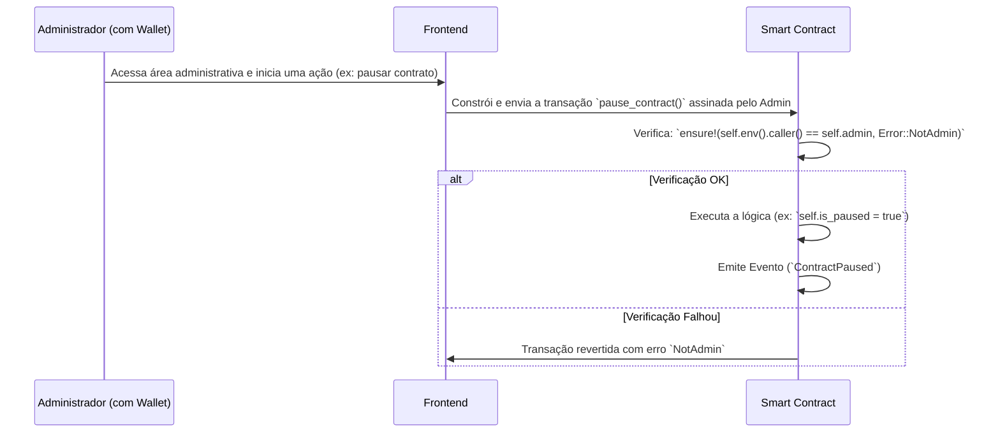

# 🚨 Plano de Melhorias Críticas - Launchpad Lunes (Arquitetura On-Chain)

## 🎯 Objetivo

Implementar as melhorias mais críticas para transformar a aplicação Launchpad Lunes em uma plataforma totalmente funcional, descentralizada e segura, baseada em smart contracts e um frontend moderno.

## 🔴 Melhorias Críticas Priorizadas

### 1. 🎨 Frontend Monorepo Completo
### 2. 🔗 Smart Contracts Funcionais e Seguros
### 3. 🔐 Controle de Acesso On-Chain Robusto

---

## 🎨 1. Frontend Monorepo Completo

### 📋 Escopo
Implementar uma base de código frontend moderna e escalável utilizando uma arquitetura de monorepo para gerenciar múltiplas aplicações (Vitrine, Dashboards, etc.).

### 🛠️ Componentes Principais

#### Estrutura Monorepo (`frontend/`)
```
frontend/
├── packages/
│   ├── showcase/          # Aplicação principal (Vitrine de projetos)
│   ├── user-dashboard/    # Dashboard do usuário
│   ├── dev-dashboard/     # Dashboard do time Lunes
│   ├── shared-ui/         # Componentes React compartilhados
│   └── shared-hooks/      # Hooks e lógica de estado compartilhada
└── pnpm-workspace.yaml    # Configuração do monorepo
```

#### Funcionalidades Essenciais
- **Conexão com Wallet**: Integração com Polkadot.js para interação com a rede Lunes.
- **Leitura de Dados On-Chain**: Exibição de dados dos projetos e fases diretamente dos smart contracts.
- **Envio de Transações**: Interface para o usuário interagir com as funções dos contratos (comprar tokens, fazer staking, etc.).
- **Dashboards**: Interfaces dedicadas para usuários e administradores.

### ⏱️ Timeline: 6-8 semanas
- **Semana 1-2**: Estrutura do monorepo e componentes compartilhados.
- **Semana 3-4**: Desenvolvimento da aplicação `showcase` e integração com a wallet.
- **Semana 5-6**: Desenvolvimento dos dashboards e funcionalidades de interação.
- **Semana 7-8**: Testes de integração e polimento da UI/UX.

---

## 🔗 2. Smart Contracts Funcionais e Seguros

### 📋 Escopo
Implementar toda a lógica de negócio do launchpad diretamente nos smart contracts ink!, garantindo segurança, eficiência de gás e capacidade de atualização.

### 🛠️ Módulos de Contrato (`smart-contracts/upgradeable/`)

#### Módulo de Governança (`governance_system.rs`)
- **Controle de Acesso**: Implementação de `Ownable` e RBAC.
- **Gerenciamento de Parâmetros**: Funções para administradores ajustarem taxas, limites, etc.
- **Sistema de Pausa**: Lógica para pausar funcionalidades críticas em caso de emergência.

#### Módulo de Registro de Projetos (`project_registry.rs` - a ser criado)
- **Cadastro de Projetos**: Lógica para administradores cadastrarem novos projetos.
- **Gerenciamento de Fases**: Configuração das fases de venda (Whitelist, Pré-venda, etc.).
- **Armazenamento de Metadados**: Estruturas para armazenar informações dos projetos.

#### Módulo de Venda de Tokens (`sales_revenue_system.rs`)
- **Lógica de Compra**: Funções para os usuários comprarem tokens.
- **Distribuição e Vesting**: Lógica para a distribuição de tokens comprados ao longo do tempo.
- **Gerenciamento de Fundos**: Coleta e roteamento seguro dos fundos arrecadados.

### ⏱️ Timeline: 4-6 semanas
- **Semana 1-2**: Módulo de Governança e Controle de Acesso.
- **Semana 3-4**: Módulo de Registro de Projetos.
- **Semana 5-6**: Módulo de Venda de Tokens e testes de segurança.

---

## 🔐 3. Controle de Acesso On-Chain Robusto

### 📋 Escopo
Garantir que todas as funções sensíveis dos smart contracts sejam protegidas por mecanismos de controle de acesso seguros e transparentes.

### 🛠️ Arquitetura de Controle de Acesso

#### Fluxo de Ação Administrativa


### 🔒 Recursos de Segurança
- **Verificação de `caller`**: Todas as funções administrativas devem verificar `self.env().caller()`.
- **Padrão `Ownable`**: Um único proprietário para as ações mais críticas.
- **Role-Based Access Control (RBAC)**: Múltiplos papéis para delegação de permissões (ex: um `project_manager` pode apenas gerenciar projetos, mas não pausar o contrato).
- **Eventos de Auditoria**: Todas as ações administrativas devem emitir eventos para transparência total.

### ⏱️ Timeline: Integrado nas 2-3 primeiras semanas do desenvolvimento dos Smart Contracts.
