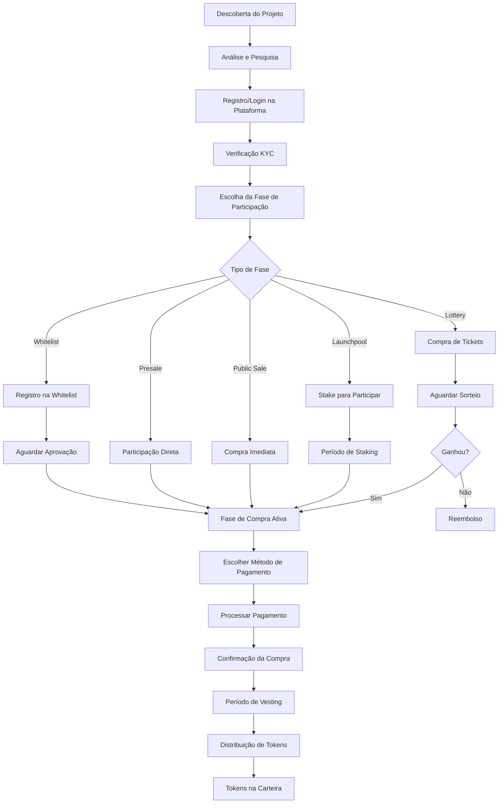

# 💰 Jornada Completa do Comprador de Tokens - Guia Detalhado

## 📋 Visão Geral

Este guia detalha **todo o fluxo** que um comprador percorre para adquirir tokens de um projeto no Launchpad Lunes, desde a descoberta até o recebimento final dos tokens.

## 🗺️ Mapa da Jornada do Comprador

### **Fluxo Completo**


## 🔍 Etapa 1: Descoberta e Análise do Projeto

### **1.1 Descoberta**
```
🔍 COMO O COMPRADOR DESCOBRE O PROJETO
├── 📱 Navegação no Launchpad Lunes
├── 🔔 Notificações push/email
├── 📢 Marketing e redes sociais
├── 🤝 Indicação de afiliados
├── 📊 Rankings e featured projects
└── 🎯 Recomendações personalizadas
```

### **1.2 Página do Projeto**
```
📄 INFORMAÇÕES DISPONÍVEIS
├── 📋 Informações Básicas
│   ├── Nome e descrição do projeto
│   ├── Equipe e roadmap
│   ├── Whitepaper e documentação
│   └── Links oficiais
├── 💰 Detalhes Financeiros
│   ├── Preço do token por fase
│   ├── Total supply e distribuição
│   ├── Hard cap e soft cap
│   └── Uso dos fundos
├── 🗳️ Rating da Comunidade
│   ├── Score final: 82/100 (Tier A)
│   ├── Avaliação da comunidade: 84/100
│   ├── Análise Safeguard: 80/100
│   └── 247 votantes participaram
├── 📅 Cronograma de Fases
│   ├── Whitelist: 01-07 Jan (Concluída)
│   ├── Presale: 08-15 Jan (Ativa)
│   ├── Public Sale: 16-23 Jan (Próxima)
│   └── Listing: 30 Jan (Planejada)
└── 📊 Estatísticas em Tempo Real
    ├── Fundos arrecadados: $234k / $500k
    ├── Participantes: 1,247
    ├── Tokens vendidos: 47%
    └── Tempo restante: 3d 14h 23m
```

## 🔗 Etapa 2: Conexão Web3 (Sem Cadastro Tradicional)

### **2.1 Conexão de Carteira Web3**
```
🔗 CONEXÃO WEB3 - SEM CADASTRO TRADICIONAL
├── 🦊 SubWallet (Recomendado para Lunes)
├── 🔴 Polkadot.js Extension
├── 🦊 MetaMask (Para cross-chain)
├── 💎 TonKeeper (Para TON)
└── 📱 WalletConnect (Mobile)
```

### **2.2 Processo de Conexão**
```
🔗 COMO CONECTAR
1. 🌐 Acesse o Launchpad Lunes
2. 🔘 Clique em "Conectar Carteira"
3. 🦊 Selecione SubWallet ou Polkadot.js
4. ✅ Autorize a conexão
5. 🎯 Pronto! Sem cadastro necessário

💡 PRIMEIRA VEZ?
├── 📥 Instale SubWallet ou Polkadot.js
├── 🔐 Crie/importe sua carteira
├── 💰 Adicione LUNES para participar
└── 🚀 Conecte e comece a investir
```

### **2.3 KYC Apenas para Valores Altos**
```
🆔 KYC OPCIONAL (Apenas para valores altos)
├── 💰 Sem KYC: Até $10,000 por projeto
├── 🆔 KYC Básico: $10,001 - $50,000
├── 🔍 KYC Completo: Acima de $50,000
└── 🌐 Filosofia Web3: Máxima liberdade

⚠️ KYC OBRIGATÓRIO APENAS QUANDO:
├── Investimento > $10,000 em um projeto
├── Volume mensal > $50,000
├── Suspeita de atividade irregular
└── Requisito regulatório específico
```

## 🎯 Etapa 3: Escolha da Fase de Participação

### **3.1 Tipos de Fases Disponíveis**

#### **🎯 Whitelist Phase**
```
🎯 WHITELIST - ACESSO EXCLUSIVO
├── 📋 Requisitos
│   ├── Conexão de carteira Web3
│   ├── Registro antecipado (apenas endereço)
│   ├── Critérios de seleção específicos
│   ├── Sem KYC (até $10k)
│   └── Limite de participantes (ex: 1000)
├── 💰 Benefícios
│   ├── Preço com desconto (10-30%)
│   ├── Garantia de alocação
│   ├── Acesso prioritário
│   └── Bônus exclusivos
├── ⏰ Timeline
│   ├── Registro: 7 dias antes (só conectar carteira)
│   ├── Seleção: 2 dias antes
│   ├── Compra: 24-48 horas
│   └── Vesting: 0-6 meses
└── 💳 Exemplo de Compra
    ├── Preço normal: $0.10
    ├── Preço whitelist: $0.07 (30% desconto)
    ├── Mínimo: $100
    ├── Máximo: $10,000 (sem KYC)
    └── Máximo: $50,000 (com KYC)
```

#### **🚀 Presale Phase**
```
🚀 PRESALE - VENDA ANTECIPADA
├── 📋 Requisitos
│   ├── Conexão de carteira Web3
│   ├── Acesso aberto (sem whitelist)
│   ├── Sem KYC (até $10k)
│   ├── Stake mínimo (opcional)
│   └── First come, first served
├── 💰 Benefícios
│   ├── Preço com desconto (5-15%)
│   ├── Bônus por volume
│   ├── Early bird bonus
│   └── Vesting reduzido
├── ⏰ Timeline
│   ├── Duração: 7-14 dias
│   ├── Compra: Imediata após conexão
│   ├── Vesting: 2-6 meses
│   └── Distribuição: Gradual
└── 💳 Exemplo de Compra
    ├── Preço normal: $0.10
    ├── Preço presale: $0.085 (15% desconto)
    ├── Bônus volume: +5% tokens (>$1000)
    ├── Early bird: +10% tokens (primeiras 24h)
    └── Máximo sem KYC: $10,000
```

#### **🌐 Public Sale Phase**
```
🌐 PUBLIC SALE - VENDA PÚBLICA
├── 📋 Requisitos
│   ├── Apenas conexão de carteira Web3
│   ├── Acesso totalmente aberto
│   ├── Sem KYC (até $10k)
│   ├── Anti-bot protection
│   └── Limites por transação
├── 💰 Características
│   ├── Preço de mercado (sem desconto)
│   ├── Sem bônus especiais
│   ├── Distribuição rápida
│   └── Vesting mínimo
├── ⏰ Timeline
│   ├── Duração: 3-7 dias
│   ├── Compra: Instantânea após conexão
│   ├── Vesting: 0-3 meses
│   └── Distribuição: 70-100% imediata
└── 💳 Exemplo de Compra
    ├── Preço: $0.10 (preço final)
    ├── Sem descontos
    ├── Mínimo: $50
    ├── Máximo: $10,000 (sem KYC)
    └── Máximo: $50,000 (com KYC)
```

#### **🏊 Launchpool Phase**
```
🏊 LAUNCHPOOL - STAKE PARA GANHAR
├── 📋 Requisitos
│   ├── Conexão de carteira Web3
│   ├── Stake de LUNES obrigatório
│   ├── Período mínimo de stake
│   ├── Sem KYC necessário
│   ├── Sem garantia de alocação
│   └── Baseado em pool share
├── 💰 Mecânica
│   ├── Stake LUNES por X dias
│   ├── Recebe tokens proporcionalmente
│   ├── Mantém LUNES originais
│   └── Recompensas extras possíveis
├── ⏰ Timeline
│   ├── Período de stake: 7-14 dias
│   ├── Snapshot: Final do período
│   ├── Distribuição: 1-3 dias após
│   └── Vesting: 0-3 meses
└── 💳 Exemplo de Participação
    ├── Stake: 10,000 LUNES por 7 dias
    ├── Pool total: 1M LUNES
    ├── Sua share: 1% (10k/1M)
    └── Tokens recebidos: 1% da alocação
```

#### **🎲 Lottery Phase**
```
🎲 LOTTERY - SORTEIO DE ALOCAÇÕES
├── 📋 Requisitos
│   ├── Conexão de carteira Web3
│   ├── Compra de tickets com LUNES
│   ├── Limite de tickets por usuário
│   ├── Sem KYC necessário
│   └── Sorteio transparente on-chain
├── 💰 Mecânica
│   ├── Cada ticket = chance de ganhar
│   ├── Preço fixo por ticket
│   ├── Múltiplos prêmios possíveis
│   └── Reembolso automático para não-ganhadores
├── ⏰ Timeline
│   ├── Venda de tickets: 3-5 dias
│   ├── Sorteio: Data específica (on-chain)
│   ├── Resultado: Imediato e verificável
│   └── Compra: 24h para ganhadores
└── 💳 Exemplo de Participação
    ├── Preço do ticket: 100 LUNES
    ├── Máximo: 10 tickets por carteira
    ├── Prêmio: $1,000 em tokens
    └── Chances: Dependem do total de tickets
```

## 💳 Etapa 4: Processo de Compra

### **4.1 Seleção de Método de Pagamento**
```
💳 MÉTODOS DE PAGAMENTO DISPONÍVEIS
├── 🏠 Lunes Network
│   ├── LUNES (nativo)
│   ├── LUSDT (stablecoin)
│   └── LUSDC (stablecoin)
├── 🔵 Solana Network
│   ├── USDT (via bridge)
│   └── USDC (via bridge)
├── 💎 TON Network
│   ├── USDT (via bridge)
│   └── USDC (via bridge)
└── 💡 Conversão Automática
    ├── Taxas em tempo real
    ├── Bridge automática
    ├── Confirmação em 2-5 min
    └── Taxa de conversão: 0.1-0.5%
```

### **4.2 Interface de Compra**
```
💰 INTERFACE DE COMPRA DE TOKENS

📊 INFORMAÇÕES DO PROJETO
├── Nome: DeFi Revolution 2024
├── Fase Atual: Presale (3 dias restantes)
├── Preço: $0.085 por token (15% desconto)
├── Sua Alocação Máxima: $5,000
└── Tokens Disponíveis: 2.3M restantes

💳 CONFIGURAÇÃO DA COMPRA
├── Valor a Investir: [$1,000] USD
├── Tokens a Receber: 11,764 tokens
│   ├── Base: 11,764 tokens
│   ├── Bônus Volume (>$1000): +588 tokens (5%)
│   └── Total Final: 12,352 tokens
├── Método de Pagamento: [LUNES ▼]
│   ├── 🏠 LUNES: 2,000 LUNES
│   ├── 🔵 USDT (Solana): 1,000 USDT
│   ├── 💎 USDC (TON): 1,000 USDC
│   └── 💰 LUSDT: 1,000 LUSDT
└── Taxa de Conversão: Incluída no preço

📅 CRONOGRAMA DE VESTING
├── Distribuição Imediata: 30% (3,706 tokens)
├── Após 1 mês: 30% (3,706 tokens)
├── Após 2 meses: 40% (4,940 tokens)
└── Total: 12,352 tokens

💰 RESUMO FINANCEIRO
├── Valor Total: $1,000
├── Taxa da Plataforma: $30 (3%)
├── Taxa de Bridge: $5 (0.5%)
├── Valor Líquido: $965
└── Tokens Finais: 12,352

⚠️ IMPORTANTE
├── Compra é irreversível após confirmação
├── Tokens seguem cronograma de vesting
├── Preço pode mudar entre fases
└── Sujeito a disponibilidade

[Conectar Carteira] [Confirmar Compra]
```

### **4.3 Processo de Pagamento**

#### **Pagamento em LUNES (Direto)**
```
🏠 PAGAMENTO EM LUNES (REDE NATIVA)
1. 🔗 Conectar carteira Lunes
2. ✅ Verificar saldo (2,000 LUNES necessários)
3. 📝 Revisar detalhes da transação
4. 🔐 Assinar transação na carteira
5. ⏳ Aguardar confirmação (12 blocos ≈ 2 min)
6. ✅ Compra confirmada automaticamente
7. 📧 Email de confirmação enviado
8. 🪙 Tokens registrados no custody system
```

#### **Pagamento Cross-Chain (USDT/USDC)**
```
🌐 PAGAMENTO CROSS-CHAIN (SOLANA/TON)
1. 🔗 Conectar carteira (MetaMask/TonKeeper)
2. ✅ Verificar saldo (1,000 USDT necessários)
3. 📝 Revisar detalhes + taxa de bridge
4. 🔐 Assinar transação na rede origem
5. 🌉 Bridge processa cross-chain (2-5 min)
6. ⏳ Aguardar confirmações (32 blocos Solana)
7. 💱 Conversão automática para LUNES
8. ✅ Compra confirmada no sistema
9. 📧 Email de confirmação enviado
10. 🪙 Tokens registrados no custody system
```

## 📋 Etapa 5: Confirmação e Registro

### **5.1 Confirmação da Compra**
```
✅ CONFIRMAÇÃO DE COMPRA REALIZADA

📊 DETALHES DA TRANSAÇÃO
├── ID da Compra: #SALE_001_2024
├── Projeto: DeFi Revolution 2024
├── Fase: Presale
├── Data/Hora: 15/01/2024 14:30 UTC
├── Status: ✅ Confirmada

💰 RESUMO FINANCEIRO
├── Valor Pago: $1,000 USD
├── Método: USDT via Solana
├── Taxa de Bridge: $5 (0.5%)
├── Taxa da Plataforma: $30 (3%)
├── Hash da Transação: 0x1234...5678

🪙 TOKENS ADQUIRIDOS
├── Quantidade Total: 12,352 tokens
├── Preço Unitário: $0.085
├── Bônus Volume: +588 tokens (5%)
├── Valor Total dos Tokens: $1,050

📅 CRONOGRAMA DE DISTRIBUIÇÃO
├── Imediato (30%): 3,706 tokens
├── 1 mês (30%): 3,706 tokens
├── 2 meses (40%): 4,940 tokens
├── Próxima Liberação: 15/02/2024
└── Distribuição Final: 15/03/2024

🔗 PRÓXIMOS PASSOS
├── [ ] Aguardar primeira distribuição (30 dias)
├── [ ] Acompanhar projeto no dashboard
├── [ ] Receber notificações de vesting
└── [ ] Tokens aparecerão na carteira automaticamente

[Ver Dashboard] [Baixar Comprovante] [Suporte]
```

### **5.2 Registro no Sistema de Custody**
```rust
// Sistema registra automaticamente a compra
custody_system.record_token_purchase(
    project_id: "defi-revolution-2024",
    phase_id: "presale",
    buyer: buyer_address,
    payment_amount: 1_000_000_000_000, // $1000
    token_amount: 12_352_000_000,      // 12,352 tokens
)

// Resultado: BuyerAllocation criada
BuyerAllocation {
    project_id: "defi-revolution-2024",
    buyer: buyer_address,
    phase_id: "presale",
    purchased_amount: 1_000_000_000_000,
    token_amount: 12_352_000_000,
    purchase_timestamp: current_time,
    distributed: false,
    distribution_tx_hash: None,
}
```

## ⏰ Etapa 6: Período de Vesting

### **6.1 Dashboard do Comprador**
```
🪙 MEU DASHBOARD DE TOKENS

📊 RESUMO GERAL
├── Total Investido: $3,500
├── Projetos Ativos: 3
├── Tokens Pendentes: 45,230
├── Tokens Recebidos: 18,770
└── Valor Estimado: $4,200 (+20%)

🎯 PROJETO: DeFi Revolution 2024
├── Investimento: $1,000
├── Tokens Totais: 12,352
├── Status: ⏳ Em Vesting
├── Progresso: ████████░░ 60% liberado
└── Próxima Liberação: 15/03/2024 (40%)

📅 CRONOGRAMA DE VESTING
├── ✅ 15/01/2024: 3,706 tokens (30%) - Distribuído
├── ✅ 15/02/2024: 3,706 tokens (30%) - Distribuído  
├── ⏳ 15/03/2024: 4,940 tokens (40%) - Pendente
└── 📊 Total Liberado: 7,412 / 12,352 tokens

💰 HISTÓRICO DE DISTRIBUIÇÕES
├── 15/01/2024: +3,706 tokens (TX: 0xabc...123)
├── 15/02/2024: +3,706 tokens (TX: 0xdef...456)
└── Próxima: 4,940 tokens em 13 dias

🔔 NOTIFICAÇÕES
├── ✅ Vesting de 15/02 processado
├── 📅 Próximo vesting em 13 dias
├── 📈 Preço do token: +15% esta semana
└── 📢 Projeto atingiu milestone técnico

[Resgatar Tokens Disponíveis] [Ver Detalhes] [Configurar Alertas]
```

### **6.2 Notificações Automáticas**
```
📧 SISTEMA DE NOTIFICAÇÕES

📅 LEMBRETES DE VESTING
├── 7 dias antes: "Próxima liberação em 1 semana"
├── 1 dia antes: "Tokens serão liberados amanhã"
├── No dia: "Tokens disponíveis para resgate"
└── 3 dias após: "Tokens ainda não resgatados"

📊 ATUALIZAÇÕES DO PROJETO
├── Milestones atingidos
├── Atualizações de desenvolvimento
├── Mudanças no cronograma
└── Notícias importantes

💰 ALERTAS DE PREÇO
├── Variação > 10% em 24h
├── Novo ATH (All Time High)
├── Oportunidades de venda
└── Alertas personalizados
```

## 🪙 Etapa 7: Distribuição de Tokens

### **7.1 Processo de Distribuição Automática**
```rust
// Sistema executa distribuição automaticamente
custody_system.distribute_tokens(
    project_id: "defi-revolution-2024",
    buyer: buyer_address,
    distribution_amount: 4_940_000_000, // 4,940 tokens finais
    vesting_phase: "final",
)

// Resultado: Tokens transferidos para carteira
TokensDistributed {
    project_id: "defi-revolution-2024",
    buyer: buyer_address,
    amount: 4_940_000_000,
    distribution_tx_hash: "0x789...abc",
    timestamp: current_time,
}
```

### **7.2 Confirmação na Carteira**
```
🪙 TOKENS RECEBIDOS NA CARTEIRA

📊 NOVA TRANSAÇÃO
├── Data: 15/03/2024 09:00 UTC
├── Tipo: Token Distribution
├── Projeto: DeFi Revolution 2024
├── Quantidade: +4,940 DEFI tokens
├── Hash: 0x789...abc
└── Status: ✅ Confirmado

💰 SALDO ATUALIZADO
├── DEFI Tokens: 12,352 (Total recebido)
├── Valor Estimado: $1,235 (+23.5%)
├── Preço Atual: $0.10 por token
└── Variação 24h: +5.2%

🎉 VESTING COMPLETO
├── ✅ Todos os tokens foram distribuídos
├── ✅ Cronograma cumprido integralmente
├── ✅ Sem pendências
└── 🚀 Tokens livres para trading
```

## 📊 Etapa 8: Pós-Distribuição

### **8.1 Opções Disponíveis**
```
🎯 O QUE FAZER COM OS TOKENS

💎 HOLD (Manter)
├── Aguardar valorização
├── Participar da governança
├── Receber dividendos (se aplicável)
└── Staking para recompensas

💰 TRADE (Negociar)
├── Vender no mercado secundário
├── Fazer swing trading
├── Arbitragem entre exchanges
└── Liquidez em DEXs

🏊 STAKE (Apostar)
├── Staking no protocolo nativo
├── Liquidity mining
├── Yield farming
└── Governance staking

🎁 PARTICIPATE (Participar)
├── Votar em propostas
├── Participar de airdrops
├── Programas de recompensas
└── Comunidade e eventos
```

### **8.2 Tracking de Performance**
```
📈 PERFORMANCE DO INVESTIMENTO

💰 RESUMO FINANCEIRO
├── Investimento Inicial: $1,000
├── Valor Atual: $1,235
├── Lucro: +$235 (+23.5%)
├── ROI: +23.5% em 2 meses
└── Anualizado: +141% APY

📊 COMPARAÇÃO COM MERCADO
├── Bitcoin: +15% no período
├── Ethereum: +18% no período
├── Seu Token: +23.5% no período
└── Outperformance: +5.5% vs ETH

🎯 MILESTONES DO PROJETO
├── ✅ MVP Lançado (Prazo)
├── ✅ Auditoria Concluída
├── ✅ Parcerias Firmadas
├── ⏳ Mainnet Launch (Próximo)
└── 📈 Roadmap: 85% completo

🏆 RATING ATUALIZADO
├── Rating Inicial: A (82/100)
├── Rating Atual: A+ (87/100)
├── Performance Real: Superou expectativas
└── Reputação dos Votantes: +5% accuracy
```

## 🎯 Casos de Uso Práticos

### **Caso 1: Comprador Whitelist Experiente**
```
👤 PERFIL: Crypto Veteran
💰 INVESTIMENTO: $5,000
🎯 ESTRATÉGIA: Whitelist + Hold

JORNADA:
1. 📅 Registra na whitelist 7 dias antes
2. ✅ Aprovado (histórico de KYC)
3. 💰 Compra máxima: $5,000 (30% desconto)
4. 🪙 Recebe: 71,428 tokens
5. ⏰ Vesting: 6 meses (20% imediato)
6. 📈 Hold até mainnet launch
7. 🎯 ROI esperado: 300-500%
```

### **Caso 2: Comprador Casual Public Sale**
```
👤 PERFIL: DeFi Newcomer  
💰 INVESTIMENTO: $200
🎯 ESTRATÉGIA: Public Sale + Quick Flip

JORNADA:
1. 🔍 Descobre projeto via marketing
2. 📝 Cria conta e faz KYC básico
3. 💰 Compra na public sale: $200
4. 🪙 Recebe: 2,000 tokens (imediato)
5. ⚡ Vesting mínimo: 70% imediato
6. 💱 Vende 50% no listing (+20%)
7. 💎 Hold 50% para longo prazo
```

### **Caso 3: Comprador Launchpool**
```
👤 PERFIL: LUNES Holder
💰 STAKE: 50,000 LUNES
🎯 ESTRATÉGIA: Launchpool + Compound

JORNADA:
1. 🏊 Stake 50k LUNES por 14 dias
2. 📊 Pool share: 2.5% (de 2M LUNES total)
3. 🪙 Recebe: 2.5% da alocação (25k tokens)
4. 💰 Mantém LUNES originais
5. 🔄 Reinveste em próximo launchpool
6. 📈 Estratégia de compound returns
```

## 🛡️ Proteções e Garantias

### **Proteções para o Comprador**
```
🛡️ PROTEÇÕES IMPLEMENTADAS
├── 🔐 Smart Contracts Auditados
├── 🏦 Custody System Seguro
├── ⚖️ Dispute Resolution
├── 📊 Transparência Total
├── 🔍 Tracking em Tempo Real
├── 💰 Refund Policy (casos específicos)
├── 🛡️ Insurance Fund (5% das taxas)
└── 📞 Suporte 24/7
```

### **Garantias de Entrega**
```
✅ GARANTIAS OFERECIDAS
├── 🪙 Tokens serão entregues conforme cronograma
├── 📅 Vesting será respeitado integralmente
├── 🔍 Auditoria completa de todas as transações
├── 💰 Reembolso em caso de falha técnica
├── 📊 Transparência total do processo
└── ⚖️ Resolução de disputas independente
```

## 📱 Experiência Mobile

### **App Mobile Otimizado**
```
📱 LAUNCHPAD LUNES MOBILE APP
├── 🔍 Descoberta de projetos
├── 📊 Dashboard personalizado
├── 💳 Compra com um toque
├── 🔔 Notificações push
├── 📈 Tracking de portfolio
├── 🪙 Gestão de tokens
├── 💬 Chat da comunidade
└── 🎯 Alertas personalizados
```

## 🎉 Conclusão

### **Jornada Otimizada**
O **fluxo do comprador** no Launchpad Lunes foi projetado para ser:

- 🎯 **Intuitivo**: Interface clara e processo guiado
- 🛡️ **Seguro**: Múltiplas camadas de proteção
- ⚡ **Rápido**: Compras em minutos, não horas
- 🌐 **Flexível**: Múltiplas opções de pagamento
- 📊 **Transparente**: Visibilidade total do processo
- 🤝 **Confiável**: Sistema auditado e comprovado

### **Diferencial Competitivo**
- 🥇 **Primeiro launchpad** com governança comunitária
- 🌐 **Pagamentos multi-chain** nativos
- 🏆 **Sistema de rating** transparente
- 🛡️ **Proteções enterprise** para compradores
- 📱 **Experiência mobile** otimizada

**O comprador tem uma jornada completa, segura e otimizada do início ao fim!** 🚀

## 🖥️ Interfaces Detalhadas por Etapa

### **Interface 1: Página de Descoberta**
```
🔍 LAUNCHPAD LUNES - PROJETOS EM DESTAQUE

🏆 PROJETOS TIER S
┌─────────────────────────────────────────────────────────┐
│ 💎 DeFi Revolution 2024                    [TIER S]     │
├─────────────────────────────────────────────────────────┤
│ 🗳️ Rating: 92/100 (347 votantes)                       │
│ 💰 Arrecadado: $234k / $500k (47%)                     │
│ ⏰ Presale: 3d 14h restantes                           │
│ 💳 Preço: $0.085 (15% desconto)                        │
│ 🎯 ROI Esperado: 200-400%                              │
│ [Ver Projeto] [Comprar Agora] [❤️ 1.2k]                │
└─────────────────────────────────────────────────────────┘

🥇 PROJETOS TIER A
┌─────────────────────────────────────────────────────────┐
│ 🚀 NFT Marketplace Pro                    [TIER A]     │
├─────────────────────────────────────────────────────────┤
│ 🗳️ Rating: 84/100 (203 votantes)                       │
│ 💰 Arrecadado: $89k / $300k (30%)                      │
│ ⏰ Whitelist: Registros abertos                        │
│ 💳 Preço: $0.12 (20% desconto whitelist)               │
│ 🎯 ROI Esperado: 150-300%                              │
│ [Ver Projeto] [Registrar Whitelist] [❤️ 856]           │
└─────────────────────────────────────────────────────────┘

📊 FILTROS E BUSCA
├── 🏆 Por Tier: [Todos ▼] [S] [A] [B] [C]
├── 📅 Por Fase: [Todas ▼] [Whitelist] [Presale] [Public]
├── 💰 Por Investimento: [$100 - $10,000]
├── 🎯 Por Categoria: [DeFi] [NFT] [Gaming] [Infrastructure]
└── 🔍 Buscar: [Digite o nome do projeto...]

🔔 ALERTAS PERSONALIZADOS
├── ☑️ Novos projetos Tier S
├── ☑️ Início de fases de venda
├── ☑️ Projetos na minha categoria favorita
└── ☑️ Oportunidades de whitelist
```

### **Interface 2: Página Detalhada do Projeto**
```
💎 DeFi REVOLUTION 2024 - PROJETO DETALHADO

📊 HEADER DO PROJETO
┌─────────────────────────────────────────────────────────┐
│ 💎 DeFi Revolution 2024                    [TIER S]     │
│ "Revolucionando DeFi com yield farming inteligente"     │
├─────────────────────────────────────────────────────────┤
│ 🗳️ Rating Comunidade: 92/100 (347 votantes)            │
│ 🛡️ Análise Safeguard: 89/100                           │
│ 🏆 Rating Final: 91/100 (TIER S)                       │
│ ⭐ Confiança: 94% dos votantes recomendam               │
└─────────────────────────────────────────────────────────┘

💰 STATUS DA VENDA ATUAL
┌─────────────────────────────────────────────────────────┐
│ 🚀 PRESALE ATIVA - 15% DE DESCONTO                     │
├─────────────────────────────────────────────────────────┤
│ ⏰ Tempo Restante: 3d 14h 23m 45s                      │
│ 💰 Progresso: ████████████░░░░ $234k / $500k (47%)     │
│ 👥 Participantes: 1,247 investidores                   │
│ 💳 Preço Atual: $0.085 (vs $0.10 público)             │
│ 🎁 Bônus Volume: +5% tokens (>$1000)                   │
│ 🎯 Sua Alocação Máx: $5,000                            │
│                                                         │
│ [💰 COMPRAR AGORA] [📋 REGISTRAR WHITELIST PRÓXIMA]     │
└─────────────────────────────────────────────────────────┘

📅 CRONOGRAMA DE FASES
├── ✅ Whitelist: 01-07 Jan (Concluída) - 1000 participantes
├── 🔥 Presale: 08-15 Jan (ATIVA) - $234k arrecadados
├── 🌐 Public Sale: 16-23 Jan - Preço final $0.10
├── 🚀 Listing: 30 Jan - PancakeSwap + Uniswap
└── 📈 Staking: 01 Fev - 25% APY inicial

👥 EQUIPE E CREDENCIAIS
├── 👨‍💻 João Silva - CTO (Ex-Binance, 8 anos DeFi)
├── 👩‍💼 Maria Santos - CEO (Ex-Coinbase, Stanford MBA)
├── 🔐 Pedro Costa - Security (Ex-OpenZeppelin)
├── 📊 Ana Lima - Tokenomics (Ex-Compound Finance)
└── [Ver Equipe Completa] [LinkedIn] [GitHub]

🔍 ANÁLISE TÉCNICA
├── 📄 Whitepaper: 47 páginas [Download PDF]
├── 🔐 Auditoria: CertiK + Quantstamp [Ver Relatórios]
├── 💻 Código: Open Source [GitHub Repository]
├── 🏛️ Governança: DAO com token voting
└── 🔗 Integrações: Chainlink, The Graph, IPFS

💰 TOKENOMICS DETALHADO
├── 📊 Total Supply: 1,000,000,000 DEFI
├── 🛒 Venda Total: 40% (400M tokens)
│   ├── Whitelist: 5% (50M) - $0.07
│   ├── Presale: 15% (150M) - $0.085
│   └── Public: 20% (200M) - $0.10
├── 🎁 Airdrop: 10% (100M tokens)
├── 👥 Equipe: 20% (200M) - Vesting 24 meses
├── 🏊 Liquidez: 15% (150M tokens)
├── 🏛️ DAO Treasury: 10% (100M tokens)
└── 🔄 Staking Rewards: 5% (50M tokens)

📈 MÉTRICAS E PROJEÇÕES
├── 🎯 ROI Esperado: 200-400% (12 meses)
├── 📊 Market Cap Inicial: $40M
├── 🚀 Market Cap Alvo: $200M (5x)
├── 💎 Holders Esperados: 50k+
└── 🏊 TVL Projetado: $100M (6 meses)

🗳️ AVALIAÇÃO DA COMUNIDADE
├── 🔧 Qualidade Técnica: 9.2/10 (Excelente)
├── 💼 Viabilidade: 8.8/10 (Muito Boa)
├── 👥 Equipe: 9.5/10 (Excepcional)
├── 💰 Tokenomics: 8.9/10 (Muito Bom)
├── 🎯 Potencial: 9.1/10 (Excelente)
└── 💡 Confiança: 9.0/10 (Muito Alta)

💬 COMENTÁRIOS DA COMUNIDADE
├── 🏆 CryptoExpert_2024: "Equipe sólida, tecnologia inovadora"
├── 🔍 DeFiAnalyst: "Tokenomics bem estruturado, potencial alto"
├── 💎 InvestorPro: "Auditoria impecável, recomendo fortemente"
└── [Ver Todos os Comentários (347)]

[💰 INVESTIR AGORA] [❤️ Favoritar] [📤 Compartilhar] [🔔 Alertas]
```

### **Interface 3: Processo de Compra**
```
💰 COMPRA DE TOKENS - DeFi Revolution 2024

📊 RESUMO DO PROJETO
┌─────────────────────────────────────────────────────────┐
│ 💎 DeFi Revolution 2024 (TIER S)                       │
│ 🚀 Presale Ativa - 15% Desconto                        │
│ ⏰ 3d 14h restantes                                    │
│ 💳 Preço: $0.085 por token                             │
└─────────────────────────────────────────────────────────┘

💳 CONFIGURAÇÃO DA COMPRA
┌─────────────────────────────────────────────────────────┐
│ 💰 VALOR DO INVESTIMENTO                                │
├─────────────────────────────────────────────────────────┤
│ Valor USD: [$1,000] (Min: $100, Máx: $5,000)          │
│ Tokens Base: 11,764 DEFI                               │
│ Bônus Volume (+5%): +588 DEFI                          │
│ Total de Tokens: 12,352 DEFI                           │
│                                                         │
│ 💡 Dica: Investimentos >$1000 ganham 5% bônus          │
└─────────────────────────────────────────────────────────┘

💳 MÉTODO DE PAGAMENTO
┌─────────────────────────────────────────────────────────┐
│ Selecione como deseja pagar:                           │
├─────────────────────────────────────────────────────────┤
│ ⚪ 🏠 LUNES (Rede Lunes)                               │
│    💰 2,000 LUNES | ⚡ Instantâneo | 🆓 Sem taxa       │
│                                                         │
│ 🔘 🔵 USDT (Solana)                                    │
│    💰 1,000 USDT | ⏱️ 2-5 min | 💸 Taxa: $5 (0.5%)    │
│                                                         │
│ ⚪ 💎 USDC (TON)                                       │
│    💰 1,000 USDC | ⏱️ 1-3 min | 💸 Taxa: $5 (0.5%)    │
│                                                         │
│ ⚪ 💚 LUSDT (Lunes)                                    │
│    💰 1,000 LUSDT | ⚡ Instantâneo | 🆓 Sem taxa       │
└─────────────────────────────────────────────────────────┘

📅 CRONOGRAMA DE VESTING
┌─────────────────────────────────────────────────────────┐
│ Seus tokens serão liberados gradualmente:              │
├─────────────────────────────────────────────────────────┤
│ ✅ Imediato (30%): 3,706 tokens                        │
│ 📅 Após 1 mês (30%): 3,706 tokens                     │
│ 📅 Após 2 meses (40%): 4,940 tokens                   │
│                                                         │
│ 📊 Total: 12,352 tokens em 2 meses                     │
│ 💡 Primeira liberação: Imediata após confirmação       │
└─────────────────────────────────────────────────────────┘

💰 RESUMO FINANCEIRO
┌─────────────────────────────────────────────────────────┐
│ Valor do Investimento: $1,000.00                       │
│ Taxa da Plataforma (3%): $30.00                        │
│ Taxa de Bridge (0.5%): $5.00                           │
│ ─────────────────────────────────                      │
│ Valor Líquido: $965.00                                 │
│ Tokens Recebidos: 12,352 DEFI                          │
│ Valor dos Tokens: $1,050.00                            │
│ Bônus Imediato: +$50.00 (+5%)                          │
└─────────────────────────────────────────────────────────┘

🔗 STATUS DA CARTEIRA
┌─────────────────────────────────────────────────────────┐
│ 🦊 SubWallet Conectada                                  │
│ 📍 Endereço: 5GrwvaEF...utQY                           │
│ 💰 Saldo LUNES: 5,247 LUNES                            │
│ ✅ Rede: Lunes Network                                  │
│ 🔐 Status: Conectada e verificada                      │
└─────────────────────────────────────────────────────────┘

⚠️ TERMOS E CONDIÇÕES
├── ☑️ Li e aceito os Termos de Uso
├── ☑️ Entendo o cronograma de vesting
├── ☑️ Estou ciente dos riscos de investimento
├── ☑️ Confirmo que sou maior de idade
└── ☑️ Aceito comunicações do projeto (opcional)

🔐 SEGURANÇA WEB3
├── 🛡️ Transação protegida por smart contract auditado
├── 🔍 Tokens registrados no sistema de custody
├── 📊 Distribuição automática conforme cronograma
├── ⚖️ Proteção por dispute resolution
└── 🔒 Sem necessidade de dados pessoais

💡 KYC APENAS SE NECESSÁRIO
├── 💰 Investimento atual: $1,000 (Sem KYC necessário)
├── 🆔 KYC obrigatório apenas acima de $10,000
├── 🌐 Filosofia Web3: Máxima privacidade
└── 🔐 Seus dados permanecem privados

[💰 Confirmar Compra] [🔄 Trocar Carteira] [❓ Ajuda]

💡 Suporte Web3: [💬 Discord] [📱 Telegram] [🐦 Twitter]
```

### **Interface 4: Dashboard Pós-Compra**
```
🪙 MEU PORTFOLIO - DASHBOARD DE TOKENS

📊 RESUMO GERAL
┌─────────────────────────────────────────────────────────┐
│ 💰 Portfolio Total: $4,235 (+18.5%)                    │
│ 📈 Lucro/Prejuízo: +$658 (30 dias)                     │
│ 🎯 Projetos Ativos: 3                                  │
│ ⏳ Tokens em Vesting: 23,450                           │
│ ✅ Tokens Disponíveis: 18,770                          │
└─────────────────────────────────────────────────────────┘

🎯 PROJETO: DeFi Revolution 2024
┌─────────────────────────────────────────────────────────┐
│ 💎 DeFi Revolution 2024                    [TIER S]     │
├─────────────────────────────────────────────────────────┤
│ 💰 Investimento: $1,000                                │
│ 🪙 Tokens Totais: 12,352 DEFI                          │
│ 📊 Valor Atual: $1,235 (+23.5%)                        │
│ 💹 Preço Token: $0.10 (+17.6% vs compra)               │
│                                                         │
│ 📅 CRONOGRAMA DE VESTING                               │
│ ✅ Imediato: 3,706 tokens (Recebido)                   │
│ ✅ 1 mês: 3,706 tokens (Recebido)                      │
│ ⏳ 2 meses: 4,940 tokens (Em 13 dias)                  │
│                                                         │
│ 📈 Progresso: ████████░░ 60% liberado                  │
│                                                         │
│ [📊 Ver Detalhes] [💰 Resgatar] [📈 Gráfico Preço]     │
└─────────────────────────────────────────────────────────┘

🔔 NOTIFICAÇÕES RECENTES
├── ✅ Vesting de 15/02 processado (+3,706 DEFI)
├── 📈 DEFI subiu 15% esta semana
├── 📅 Próximo vesting em 13 dias (4,940 tokens)
├── 🎯 Projeto atingiu milestone de desenvolvimento
└── 📢 Nova parceria anunciada

📅 PRÓXIMOS EVENTOS
├── 🪙 15/03: Liberação final de tokens (4,940 DEFI)
├── 🚀 20/03: Mainnet launch oficial
├── 🏊 25/03: Início do staking (25% APY)
├── 📊 30/03: Listagem em exchanges tier-1
└── 🗳️ 05/04: Primeira votação de governança

💰 AÇÕES DISPONÍVEIS
├── [💰 Resgatar Tokens Disponíveis]
├── [📊 Ver Histórico Completo]
├── [🔔 Configurar Alertas]
├── [📤 Compartilhar Performance]
├── [💬 Entrar na Comunidade]
└── [🎯 Investir em Novos Projetos]

📈 PERFORMANCE DETALHADA
┌─────────────────────────────────────────────────────────┐
│ 📊 MÉTRICAS DE PERFORMANCE (30 dias)                   │
├─────────────────────────────────────────────────────────┤
│ ROI: +23.5% (vs +15% Bitcoin, +18% Ethereum)           │
│ Melhor Dia: +8.2% (22/02)                              │
│ Volatilidade: Média (±12% semanal)                     │
│ Volume 24h: $2.3M                                      │
│ Market Cap: $45M                                       │
│ Ranking: #247 CoinGecko                                │
└─────────────────────────────────────────────────────────┘

🎯 RECOMENDAÇÕES PERSONALIZADAS
├── 💡 Considere fazer staking quando disponível (25% APY)
├── 🎯 Novo projeto Tier A disponível na sua categoria
├── 📊 Oportunidade de arbitragem detectada
└── 🏆 Você está no top 15% dos investidores do projeto
```

**Esta jornada completa garante uma experiência excepcional para todos os tipos de compradores!** 🚀
