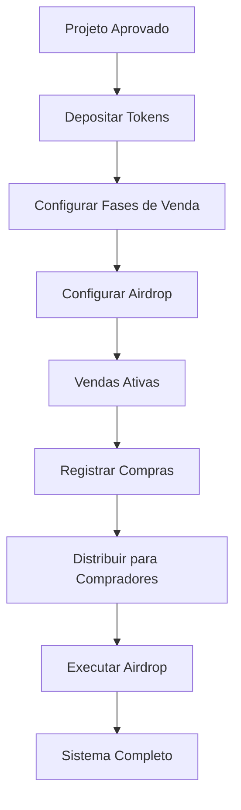

# 🪙 Guia Completo: Depósito e Distribuição de Tokens

## 📋 Visão Geral

O **sistema de depósito e distribuição de tokens** do Launchpad Lunes foi **completamente redesenhado** para o novo sistema de contratos atualizáveis, oferecendo:

- ✅ **Depósito seguro** de tokens para venda
- ✅ **Distribuição automática** para compradores
- ✅ **Sistema de airdrop** com regras inteligentes
- ✅ **Escrow** com condições de liberação
- ✅ **Auditoria completa** de todas as operações

## 🏗️ Arquitetura do Sistema

### **Componentes Principais**
```
🪙 Token Custody & Distribution System
├── 📦 Token Deposits (Depósitos de projeto)
├── 🛒 Buyer Allocations (Alocações de compradores)
├── 🎁 Airdrop Campaigns (Campanhas de airdrop)
├── 📊 Distribution Engine (Motor de distribuição)
└── 🔍 Audit Trail (Trilha de auditoria)
```

### **Fluxo Completo**


## 💰 Processo de Depósito de Tokens

### **1. Preparação do Depósito**

#### **1.1 Cálculo das Alocações**
```rust
// Exemplo de alocação típica
let total_supply = 1_000_000_000; // 1 bilhão de tokens

// Distribuição recomendada:
let sale_allocation = 400_000_000;    // 40% para vendas
let airdrop_allocation = 100_000_000; // 10% para airdrop
let team_reserve = 300_000_000;       // 30% para equipe
let liquidity_pool = 200_000_000;     // 20% para liquidez
```

#### **1.2 Configuração de Fases**
```rust
let phases = vec![
    PhaseAllocation {
        phase_id: "whitelist".to_string(),
        phase_type: PhaseType::Whitelist,
        allocated_tokens: 50_000_000,     // 50M tokens
        token_price: 100_000_000,         // 0.1 LUNES por token
        max_participants: Some(1000),
        start_time: 1704067200,           // 01/01/2024
        end_time: 1704153600,             // 02/01/2024
        distributed_tokens: 0,
        participants_count: 0,
    },
    PhaseAllocation {
        phase_id: "presale".to_string(),
        phase_type: PhaseType::Presale,
        allocated_tokens: 150_000_000,    // 150M tokens
        token_price: 120_000_000,         // 0.12 LUNES por token
        max_participants: Some(5000),
        start_time: 1704240000,           // 03/01/2024
        end_time: 1704672000,             // 08/01/2024
        distributed_tokens: 0,
        participants_count: 0,
    },
    PhaseAllocation {
        phase_id: "public_sale".to_string(),
        phase_type: PhaseType::PublicSale,
        allocated_tokens: 200_000_000,    // 200M tokens
        token_price: 150_000_000,         // 0.15 LUNES por token
        max_participants: None,           // Sem limite
        start_time: 1704758400,           // 09/01/2024
        end_time: 1705190400,             // 14/01/2024
        distributed_tokens: 0,
        participants_count: 0,
    }
];
```

### **2. Execução do Depósito**

#### **2.1 Chamada da Função de Depósito**
```rust
// Depositar tokens no sistema de custódia
custody_system.deposit_project_tokens(
    project_id: "defi-innovation-2024".to_string(),
    token_address: AccountId::from([0x12; 32]), // Endereço do token
    total_amount: 500_000_000,                  // 500M tokens total
    sale_allocation: 400_000_000,               // 400M para vendas
    airdrop_allocation: 100_000_000,            // 100M para airdrop
    phases: phases,                             // Configuração de fases
    deposit_tx_hash: "0xabc123...".to_string(), // Hash da transação
)
```

#### **2.2 Validações Automáticas**
```rust
// O sistema valida automaticamente:
✅ sale_allocation + airdrop_allocation == total_amount
✅ Soma das fases == sale_allocation
✅ Datas das fases são válidas
✅ Preços são positivos
✅ Token address é válido
✅ Depósito foi realmente feito
```

## 🛒 Sistema de Compras e Alocações

### **3. Registro de Compras**

#### **3.1 Quando um Usuário Compra Tokens**
```rust
// Sistema registra a compra automaticamente
custody_system.record_token_purchase(
    project_id: "defi-innovation-2024".to_string(),
    phase_id: "presale".to_string(),
    buyer: AccountId::from([0x34; 32]),    // Endereço do comprador
    payment_amount: 1_200_000_000,         // 12 LUNES pagos
    token_amount: 100_000_000,             // 100 tokens comprados
)
```

#### **3.2 Alocação Criada**
```rust
BuyerAllocation {
    project_id: "defi-innovation-2024".to_string(),
    buyer: AccountId::from([0x34; 32]),
    phase_id: "presale".to_string(),
    purchased_amount: 1_200_000_000,       // Valor pago
    token_amount: 100_000_000,             // Tokens a receber
    purchase_timestamp: 1704350000,
    distributed: false,                    // Ainda não distribuído
    distribution_tx_hash: None,
}
```

## 📦 Distribuição para Compradores

### **4. Distribuição Automática**

#### **4.1 Distribuição em Lote**
```rust
// Distribuir para múltiplos compradores
let buyers = vec![
    AccountId::from([0x34; 32]),
    AccountId::from([0x56; 32]),
    AccountId::from([0x78; 32]),
    // ... mais compradores
];

let distributed_count = custody_system.distribute_tokens_to_buyers(
    "defi-innovation-2024".to_string(),
    buyers,
)?;

println!("Distribuído para {} compradores", distributed_count);
```

#### **4.2 Processo de Distribuição**
```rust
// Para cada comprador:
1. ✅ Verificar se tem alocação
2. ✅ Verificar se ainda não foi distribuído
3. ✅ Executar transferência de tokens
4. ✅ Marcar como distribuído
5. ✅ Registrar hash da transação
6. ✅ Emitir evento de distribuição
```

## 🎁 Sistema de Airdrop

### **5. Criação de Campanha de Airdrop**

#### **5.1 Configuração da Campanha**
```rust
// Criar campanha de airdrop
custody_system.create_airdrop_campaign(
    campaign_id: "defi-airdrop-2024".to_string(),
    project_id: "defi-innovation-2024".to_string(),
    total_allocation: 100_000_000,          // 100M tokens
    campaign_duration_days: 60,             // 60 dias de campanha
)?;
```

#### **5.2 Distribuição Automática**
```rust
// Distribuição automática após 30 dias:
// 60% para Smart Fund
// 40% para comunidade elegível

AirdropCampaign {
    campaign_id: "defi-airdrop-2024".to_string(),
    project_id: "defi-innovation-2024".to_string(),
    token_address: AccountId::from([0x12; 32]),
    total_allocation: 100_000_000,
    smart_fund_allocation: 60_000_000,      // 60% = 60M tokens
    community_allocation: 40_000_000,       // 40% = 40M tokens
    distributed_amount: 0,
    campaign_start: 1704067200,
    campaign_end: 1709251200,               // +60 dias
    distribution_delay: 2_592_000,          // +30 dias após fim
    status: AirdropStatus::Active,
    created_by: AccountId::from([0x01; 32]),
}
```

### **6. Execução do Airdrop**

#### **6.1 Critérios de Elegibilidade**
```rust
// Usuários elegíveis para airdrop (40% da alocação)
let eligible_recipients = vec![
    (AccountId::from([0x11; 32]), 1_000_000), // 1M tokens
    (AccountId::from([0x22; 32]), 2_000_000), // 2M tokens
    (AccountId::from([0x33; 32]), 500_000),   // 500K tokens
    // ... baseado em critérios de elegibilidade
];

let smart_fund_address = AccountId::from([0xFF; 32]);
```

#### **6.2 Distribuição Final**
```rust
// Executar distribuição completa
custody_system.execute_airdrop_distribution(
    "defi-airdrop-2024".to_string(),
    eligible_recipients,
    smart_fund_address,
)?;

// Resultado:
// ✅ 60M tokens → Smart Fund
// ✅ 40M tokens → Comunidade elegível
// ✅ Eventos emitidos para auditoria
// ✅ Status atualizado para "Distributed"
```

## 📊 Interface de Usuário

### **Dashboard do Projeto**
```
🪙 Gestão de Tokens - Projeto DeFi Innovation

📦 DEPÓSITO DE TOKENS
├── Total Depositado: 500M tokens ✅
├── Alocação Vendas: 400M tokens (80%)
├── Alocação Airdrop: 100M tokens (20%)
└── Status: Ativo ✅

🛒 VENDAS POR FASE
├── Whitelist: 50M tokens | 45M vendidos (90%) ✅
├── Presale: 150M tokens | 120M vendidos (80%) ✅
└── Public Sale: 200M tokens | 180M vendidos (90%) ✅

📦 DISTRIBUIÇÃO PARA COMPRADORES
├── Total Compradores: 2,847
├── Tokens Distribuídos: 345M (86.25%)
├── Pendente Distribuição: 55M (13.75%)
└── [Botão: Distribuir Pendentes]

🎁 AIRDROP
├── Campanha: Ativa (30 dias restantes)
├── Alocação Total: 100M tokens
├── Smart Fund (60%): 60M tokens
├── Comunidade (40%): 40M tokens
└── Status: Aguardando fim da campanha
```

### **Dashboard do Comprador**
```
🛒 Minhas Compras - DeFi Innovation

📊 RESUMO
├── Total Investido: 12 LUNES
├── Tokens Comprados: 100 tokens
├── Fase: Presale
└── Data da Compra: 03/01/2024

📦 STATUS DA DISTRIBUIÇÃO
├── Status: ✅ Distribuído
├── Quantidade: 100 tokens
├── Data Distribuição: 15/01/2024
├── TX Hash: 0xabc123...
└── [Ver na Blockchain]

🎁 AIRDROP ELEGÍVEL
├── Campanha: DeFi Innovation Airdrop
├── Elegibilidade: ✅ Qualificado
├── Tokens Estimados: 5,000 tokens
└── Distribuição: 30 dias após campanha
```

## 🔍 Auditoria e Transparência

### **7. Trilha de Auditoria Completa**

#### **7.1 Eventos Registrados**
```rust
// Todos os eventos são registrados na blockchain:

TokensDeposited {
    project_id: "defi-innovation-2024",
    depositor: 0x01...,
    token_address: 0x12...,
    total_amount: 500_000_000,
    sale_allocation: 400_000_000,
    airdrop_allocation: 100_000_000,
    timestamp: 1704067200,
}

TokensPurchased {
    project_id: "defi-innovation-2024",
    buyer: 0x34...,
    phase_id: "presale",
    payment_amount: 1_200_000_000,
    token_amount: 100_000_000,
    timestamp: 1704350000,
}

TokensDistributed {
    project_id: "defi-innovation-2024",
    recipient: 0x34...,
    distribution_type: SaleDistribution,
    amount: 100_000_000,
    tx_hash: "dist_defi_0x34_100000000_1705000000",
    timestamp: 1705000000,
}

AirdropDistributionExecuted {
    campaign_id: "defi-airdrop-2024",
    total_distributed: 100_000_000,
    recipients_count: 1001, // 1000 comunidade + 1 smart fund
    smart_fund_amount: 60_000_000,
    community_amount: 40_000_000,
    timestamp: 1711843200,
}
```

#### **7.2 Consultas de Auditoria**
```rust
// Verificar depósito do projeto
let deposit = custody_system.get_project_deposit("defi-innovation-2024");

// Verificar alocação de comprador
let allocation = custody_system.get_buyer_allocation(
    "defi-innovation-2024", 
    AccountId::from([0x34; 32])
);

// Verificar campanha de airdrop
let campaign = custody_system.get_airdrop_campaign("defi-airdrop-2024");
```

## 🛡️ Recursos de Segurança

### **8. Proteções Implementadas**

#### **8.1 Validações de Segurança**
- ✅ **Verificação de Saldo**: Tokens realmente depositados
- ✅ **Alocação Correta**: Soma das alocações = total
- ✅ **Anti-Double Spending**: Prevenção de distribuição dupla
- ✅ **Time Locks**: Airdrop só após período de espera
- ✅ **Admin Controls**: Apenas admins podem distribuir
- ✅ **Emergency Pause**: Pausa de emergência disponível

#### **8.2 Controles de Acesso**
```rust
// Apenas admin pode:
- Registrar compras
- Distribuir tokens
- Criar campanhas de airdrop
- Executar distribuições

// Emergency admin pode:
- Pausar sistema em emergência
- Cancelar operações críticas
```

## 📋 Checklist para Projetos

### **Preparação do Depósito** ✅
- [ ] Token contract deployado e auditado
- [ ] Alocações calculadas (vendas + airdrop)
- [ ] Fases de venda configuradas
- [ ] Preços definidos por fase
- [ ] Cronograma validado

### **Execução do Depósito** ✅
- [ ] Tokens transferidos para custody contract
- [ ] Função `deposit_project_tokens()` chamada
- [ ] Validações automáticas passaram
- [ ] Evento `TokensDeposited` emitido
- [ ] Status confirmado como "Active"

### **Gestão de Vendas** ✅
- [ ] Sistema de compras integrado
- [ ] Registros automáticos funcionando
- [ ] Alocações sendo criadas corretamente
- [ ] Distribuições programadas

### **Configuração de Airdrop** ✅
- [ ] Campanha criada com alocação correta
- [ ] Critérios de elegibilidade definidos
- [ ] Smart Fund address configurado
- [ ] Delay de 30 dias configurado

### **Distribuição Final** ✅
- [ ] Compradores receberam tokens
- [ ] Airdrop executado após delay
- [ ] Smart Fund recebeu 60%
- [ ] Comunidade recebeu 40%
- [ ] Auditoria completa disponível

## 🎯 Resumo: Como Funciona

### **Para o Projeto:**
1. 📦 **Depositar tokens** no custody contract
2. ⚙️ **Configurar fases** de venda e airdrop
3. 🛒 **Vendas automáticas** registradas pelo sistema
4. 📊 **Distribuir tokens** para compradores
5. 🎁 **Airdrop automático** após período de campanha

### **Para o Comprador:**
1. 🛒 **Comprar tokens** durante fases ativas
2. ⏳ **Aguardar distribuição** (automática)
3. 🪙 **Receber tokens** na carteira
4. 🎁 **Receber airdrop** se elegível

### **Para o Sistema:**
1. 🔒 **Custódia segura** de todos os tokens
2. 📊 **Distribuição automática** baseada em regras
3. 🔍 **Auditoria completa** de todas as operações
4. 🛡️ **Proteções de segurança** em todas as camadas

**O sistema está completamente automatizado, seguro e transparente!** 🚀
