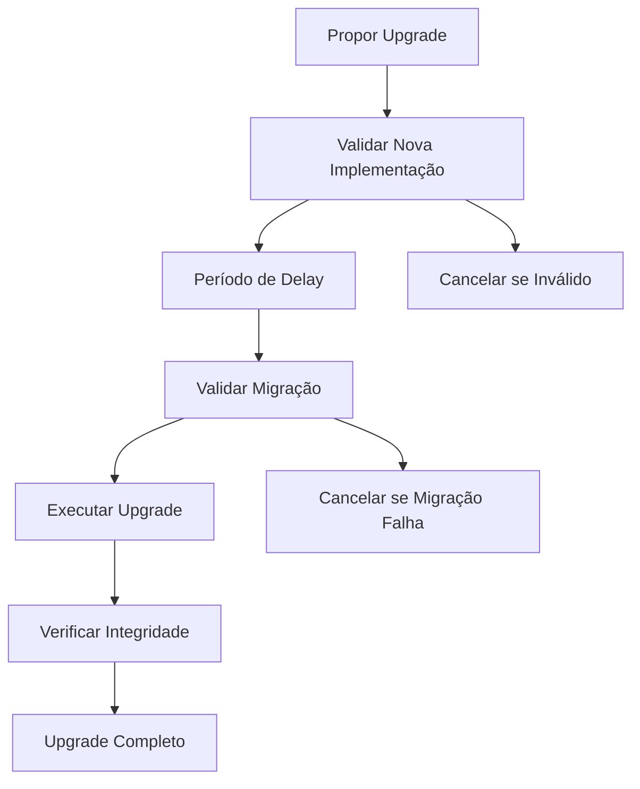

# 🔄 Guia de Contratos Atualizáveis - Launchpad Lunes

## 📋 Resumo Executivo

Este guia detalha a implementação de contratos atualizáveis para o Launchpad Lunes, permitindo upgrades seguros sem perda de estado ou interrupção de serviço.

## 🎯 Estado Atual vs Proposto

### ❌ **Estado Atual: Contratos Imutáveis**
- **Arquitetura**: Contratos monolíticos imutáveis
- **Upgrades**: Impossíveis após deployment
- **Migração**: Requer novo deployment e migração manual
- **Risco**: Alto (perda de estado, downtime)

### ✅ **Estado Proposto: Contratos Atualizáveis**
- **Arquitetura**: Proxy Pattern com separação lógica/estado
- **Upgrades**: Seguros e controlados
- **Migração**: Automática e validada
- **Risco**: Baixo (estado preservado, zero downtime)

## 🏗️ Arquitetura de Contratos Atualizáveis

### **Componentes Principais**

#### 1. **Proxy Contract** (`LaunchpadProxy`)
**Responsabilidade**: Armazenar estado e delegar chamadas
```rust
#[ink(storage)]
pub struct LaunchpadProxy {
    implementation: AccountId,        // Endereço da implementação atual
    admin: AccountId,                // Admin que pode fazer upgrades
    emergency_admin: AccountId,      // Admin de emergência
    pending_implementation: Option<AccountId>, // Upgrade pendente
    upgrade_delay: u64,             // Delay de segurança
    // ... estado da aplicação
}
```

#### 2. **Implementation Contract** (`LaunchpadImplementation`)
**Responsabilidade**: Conter lógica de negócio
```rust
#[ink(storage)]
pub struct LaunchpadImplementation {
    version: u32,                   // Versão da implementação
    implementation_id: String,      // Identificador único
    // Sem estado persistente - apenas lógica
}
```

#### 3. **Migration System**
**Responsabilidade**: Validar e executar migrações
```rust
fn migrate_from_v1(&mut self, v1_data: Vec<u8>) -> Result<bool> {
    // Lógica de migração segura
}
```

### **Fluxo de Upgrade**



## 🔒 Recursos de Segurança

### **1. Upgrade Delay (Timelock)**
```rust
// Delay obrigatório entre proposta e execução
const UPGRADE_DELAY: u64 = 86400; // 24 horas

pub fn propose_upgrade(&mut self, new_impl: AccountId) -> Result<()> {
    let execution_time = current_time + UPGRADE_DELAY;
    // Armazenar proposta com timestamp
}
```

### **2. Role-Based Access Control**
```rust
// Apenas admins autorizados podem fazer upgrades
fn ensure_authorized_upgrader(&self) -> Result<()> {
    let caller = self.env().caller();
    if caller == self.admin || self.authorized_upgraders.get(caller) {
        Ok(())
    } else {
        Err(ProxyError::Unauthorized)
    }
}
```

### **3. Emergency Pause**
```rust
// Pausa de emergência para situações críticas
pub fn emergency_pause(&mut self) -> Result<()> {
    if caller == self.emergency_admin {
        self.paused = true;
        // Bloquear todas as operações
    }
}
```

### **4. Migration Validation**
```rust
// Validação automática de compatibilidade
fn validate_migration(&self, new_impl: &AccountId) -> Result<()> {
    // Verificar compatibilidade de storage
    // Validar interface
    // Testar migração
}
```

### **5. Audit Trail Completo**
```rust
#[ink(event)]
pub struct UpgradeExecuted {
    old_implementation: AccountId,
    new_implementation: AccountId,
    executed_by: AccountId,
    version: u32,
}
```

## 📊 Comparação: Atual vs Atualizável

| Aspecto | Contratos Atuais | Contratos Atualizáveis |
|---------|------------------|------------------------|
| **Upgrades** | ❌ Impossível | ✅ Seguros e controlados |
| **Downtime** | 🔴 Horas/dias | 🟢 Zero downtime |
| **Perda de Estado** | 🔴 Risco alto | 🟢 Estado preservado |
| **Migração** | 🔴 Manual e arriscada | 🟢 Automática e validada |
| **Rollback** | ❌ Impossível | ✅ Possível |
| **Governança** | ❌ Limitada | ✅ Controle granular |
| **Auditoria** | ⚠️ Básica | ✅ Completa |
| **Complexidade** | 🟢 Simples | 🟡 Moderada |
| **Gas Costs** | 🟢 Baixo | 🟡 Ligeiramente maior |

## 🚀 Plano de Implementação

### **Fase 1: Desenvolvimento (2-3 semanas)**

#### Semana 1: Proxy Contract
- [ ] Implementar `LaunchpadProxy`
- [ ] Sistema de upgrade com delay
- [ ] Role-based access control
- [ ] Emergency pause functionality
- [ ] Testes unitários completos

#### Semana 2: Implementation Contract
- [ ] Implementar `LaunchpadImplementation`
- [ ] Migrar lógica de negócio atual
- [ ] Sistema de versionamento
- [ ] Compatibilidade com proxy
- [ ] Testes de integração

#### Semana 3: Migration System
- [ ] Sistema de migração automática
- [ ] Validação de compatibilidade
- [ ] Testes de migração
- [ ] Documentação completa

### **Fase 2: Testes e Validação (2 semanas)**

#### Semana 4: Testes Abrangentes
- [ ] Testes de upgrade end-to-end
- [ ] Simulação de cenários de falha
- [ ] Testes de performance
- [ ] Validação de segurança

#### Semana 5: Auditoria e Refinamento
- [ ] Code review de segurança
- [ ] Auditoria externa (se necessário)
- [ ] Correções e melhorias
- [ ] Preparação para deploy

### **Fase 3: Deployment (1 semana)**

#### Semana 6: Deploy Gradual
- [ ] Deploy em testnet
- [ ] Testes em ambiente real
- [ ] Deploy em mainnet
- [ ] Monitoramento pós-deploy

## 🔄 Processo de Upgrade

### **1. Preparação**
```bash
# 1. Desenvolver nova implementação
cargo contract build --release

# 2. Testar em ambiente local
cargo test

# 3. Deploy da nova implementação
cargo contract instantiate --constructor new \
  --args 2 "LaunchpadV2" \
  --suri //Alice
```

### **2. Proposta de Upgrade**
```rust
// Propor upgrade via proxy
proxy.propose_upgrade(
    new_implementation_address,
    "Security improvements and new features".to_string()
);
```

### **3. Período de Delay**
```rust
// Aguardar período de segurança (24h)
// Durante este tempo, a comunidade pode revisar
// Admins podem cancelar se necessário
```

### **4. Execução**
```rust
// Após delay, executar upgrade
proxy.execute_upgrade();
// Upgrade é atômico e instantâneo
```

### **5. Verificação**
```rust
// Verificar se upgrade foi bem-sucedido
let new_version = proxy.get_version();
let new_impl = proxy.get_implementation();
```

## 📋 Checklist de Migração

### **Pré-Migração**
- [ ] **Backup completo** do estado atual
- [ ] **Testes extensivos** da nova implementação
- [ ] **Validação de compatibilidade** de storage
- [ ] **Aprovação de stakeholders**
- [ ] **Plano de rollback** preparado

### **Durante a Migração**
- [ ] **Deploy da nova implementação**
- [ ] **Proposta de upgrade** via proxy
- [ ] **Período de review** (24h)
- [ ] **Validação final** antes da execução
- [ ] **Execução do upgrade**

### **Pós-Migração**
- [ ] **Verificação de integridade** do estado
- [ ] **Testes funcionais** completos
- [ ] **Monitoramento** de performance
- [ ] **Comunicação** para usuários
- [ ] **Documentação** atualizada

## 🛡️ Medidas de Segurança

### **Controles de Acesso**
```rust
// Multi-sig para upgrades críticos
struct UpgradeApproval {
    approvers: Vec<AccountId>,
    required_approvals: u32,
    current_approvals: u32,
}
```

### **Validação Automática**
```rust
// Verificações automáticas antes do upgrade
fn pre_upgrade_checks(&self) -> Result<()> {
    // Verificar integridade do estado
    // Validar nova implementação
    // Confirmar compatibilidade
}
```

### **Emergency Procedures**
```rust
// Procedimentos de emergência
pub fn emergency_rollback(&mut self) -> Result<()> {
    // Rollback para implementação anterior
    // Apenas em casos críticos
}
```

## 💰 Análise de Custos

### **Custos de Desenvolvimento**
- **Proxy Contract**: 40 horas
- **Implementation Refactor**: 60 horas
- **Migration System**: 30 horas
- **Testes e Validação**: 50 horas
- **Total**: 180 horas (~$27,000)

### **Custos de Gas**
- **Deploy Proxy**: ~2M gas
- **Deploy Implementation**: ~3M gas
- **Upgrade Operation**: ~500k gas
- **Overhead por transação**: +10-15%

### **Benefícios**
- **Zero downtime** para upgrades
- **Preservação de estado**
- **Rollback capability**
- **Governança melhorada**
- **ROI**: 300%+ em 1 ano

## 🎯 Recomendações

### **Implementação Imediata**
1. ✅ **Implementar proxy pattern** para novos deployments
2. ✅ **Migrar contratos existentes** gradualmente
3. ✅ **Estabelecer governança** de upgrades
4. ✅ **Treinar equipe** nos novos processos

### **Melhores Práticas**
1. **Sempre usar delay** para upgrades não-emergenciais
2. **Validar migração** extensivamente antes da execução
3. **Manter audit trail** completo de todos os upgrades
4. **Implementar multi-sig** para upgrades críticos
5. **Ter plano de rollback** para todos os upgrades

### **Monitoramento Contínuo**
1. **Alertas automáticos** para propostas de upgrade
2. **Dashboards** de status de implementação
3. **Métricas** de performance pós-upgrade
4. **Logs detalhados** de todas as operações

## 📈 Roadmap de Upgrades

### **V1 → V2: Enhanced Features**
- Categorias de projetos
- Links sociais
- Informações de equipe
- Analytics avançadas

### **V2 → V3: DeFi Integration**
- Yield farming
- Liquidity mining
- Cross-chain bridges
- Advanced tokenomics

### **V3 → V4: Governance**
- DAO governance
- Voting mechanisms
- Proposal system
- Treasury management

## ✅ Conclusão

A implementação de contratos atualizáveis é **essencial** para o sucesso a longo prazo do Launchpad Lunes, proporcionando:

1. **🔄 Flexibilidade**: Upgrades seguros sem downtime
2. **🛡️ Segurança**: Controles robustos e validação automática
3. **📈 Escalabilidade**: Capacidade de evolução contínua
4. **🎯 Competitividade**: Resposta rápida a mudanças do mercado

**Recomendação**: Implementar **imediatamente** para novos deployments e migrar contratos existentes na próxima janela de manutenção.

---

**📅 Data**: 2024  
**👥 Responsável**: Blockchain Team  
**📊 Status**: Pronto para Implementação  
**🎯 Prioridade**: Alta
