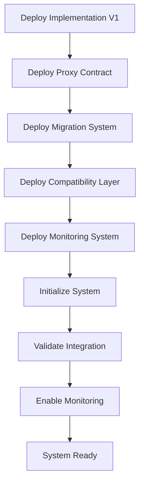

# 🚀 Guia de Deploy - Sistema de Contratos Atualizáveis

## 📋 Visão Geral

Este guia detalha o processo completo de deploy do **sistema de contratos atualizáveis** do Launchpad Lunes, incluindo procedimentos de upgrade e migração.

## 🎯 Arquitetura de Deploy

### **Sistema Completo**
```
Launchpad Lunes Upgradeable System
├── 🔄 Proxy Contract (Estado + Delegação)
├── 🏗️ Implementation V1 (Lógica de Negócio)
├── 🔄 Migration System (Migração Automática)
├── 🔗 Compatibility Layer (Backward Compatibility)
└── 📊 Monitoring System (Monitoramento Real-time)
```

### **Fluxo de Deploy**


## 🛠️ Pré-Requisitos

### **Ambiente de Desenvolvimento**
```bash
# Rust toolchain
rustup update stable
rustup target add wasm32-unknown-unknown

# ink! CLI
cargo install cargo-contract --force

# Substrate contracts node
cargo install contracts-node --git https://github.com/paritytech/substrate-contracts-node.git

# Polkadot.js CLI
npm install -g @polkadot/api-cli
```

### **Configuração de Rede**
```bash
# Testnet (Rococo Contracts)
NETWORK=rococo-contracts
RPC_URL=wss://rococo-contracts-rpc.polkadot.io

# Mainnet (Polkadot/Kusama)
NETWORK=polkadot
RPC_URL=wss://rpc.polkadot.io
```

## 📦 Processo de Build

### **1. Build dos Contratos**
```bash
cd smart-contracts/upgradeable

# Build implementation contract
cargo contract build --release --manifest-path implementation_base.rs

# Build proxy contract
cargo contract build --release --manifest-path proxy_contract.rs

# Build migration system
cargo contract build --release --manifest-path migration_system.rs

# Build compatibility layer
cargo contract build --release --manifest-path compatibility_layer.rs

# Build monitoring system
cargo contract build --release --manifest-path proxy_monitoring.rs
```

### **2. Validação dos Builds**
```bash
# Verificar artefatos gerados
ls -la target/ink/

# Validar metadata
cargo contract check --manifest-path proxy_contract.rs
cargo contract check --manifest-path implementation_base.rs
```

## 🚀 Deploy em Testnet

### **Fase 1: Deploy da Implementation V1**
```bash
# Deploy implementation contract
cargo contract instantiate \
  --constructor new \
  --args 1 "LaunchpadV1" \
  --suri //Alice \
  --url $RPC_URL \
  --manifest-path implementation_base.rs

# Capturar endereço da implementation
IMPLEMENTATION_V1_ADDRESS="5GrwvaEF5zXb26Fz9rcQpDWS57CtERHpNehXCPcNoHGKutQY"
```

### **Fase 2: Deploy do Proxy Contract**
```bash
# Deploy proxy contract
cargo contract instantiate \
  --constructor new \
  --args $IMPLEMENTATION_V1_ADDRESS //Alice //Bob 86400 2 \
  --suri //Alice \
  --url $RPC_URL \
  --manifest-path proxy_contract.rs

# Capturar endereço do proxy
PROXY_ADDRESS="5FHneW46xGXgs5mUiveU4sbTyGBzmstUspZC92UhjJM694ty"
```

### **Fase 3: Deploy do Migration System**
```bash
# Deploy migration system
cargo contract instantiate \
  --constructor new \
  --args //Alice //Bob \
  --suri //Alice \
  --url $RPC_URL \
  --manifest-path migration_system.rs

# Capturar endereço do migration system
MIGRATION_ADDRESS="5DAAnrj7VHTznn2AWBemMuyBwZWs6FNFjdyVXUeYum3PTXFy"
```

### **Fase 4: Deploy da Compatibility Layer**
```bash
# Deploy compatibility layer
cargo contract instantiate \
  --constructor new \
  --args //Alice \
  --suri //Alice \
  --url $RPC_URL \
  --manifest-path compatibility_layer.rs

# Capturar endereço da compatibility layer
COMPATIBILITY_ADDRESS="5GNJqTPyNqANBkUVMN1LPPrxXnFouWXoe2wNSmmEoLctxiZY"
```

### **Fase 5: Deploy do Monitoring System**
```bash
# Deploy monitoring system
cargo contract instantiate \
  --constructor new \
  --args $PROXY_ADDRESS //Alice \
  --suri //Alice \
  --url $RPC_URL \
  --manifest-path proxy_monitoring.rs

# Capturar endereço do monitoring
MONITORING_ADDRESS="5HpG9w8EBLe5XCrbczpwq5TSXvedjrBGCwqxK1iQ7qUsSWFc"
```

## 🔧 Configuração Inicial

### **1. Configurar Proxy**
```bash
# Adicionar upgraders autorizados
cargo contract call \
  --contract $PROXY_ADDRESS \
  --message add_upgrader \
  --args //Charlie \
  --suri //Alice \
  --url $RPC_URL

# Configurar delay de upgrade (se necessário)
cargo contract call \
  --contract $PROXY_ADDRESS \
  --message set_upgrade_delay \
  --args 172800 \
  --suri //Alice \
  --url $RPC_URL
```

### **2. Configurar Implementation**
```bash
# Definir endereço do proxy na implementation
cargo contract call \
  --contract $IMPLEMENTATION_V1_ADDRESS \
  --message set_proxy_address \
  --args $PROXY_ADDRESS \
  --suri //Alice \
  --url $RPC_URL
```

### **3. Configurar Monitoring**
```bash
# Configurar thresholds de alerta
cargo contract call \
  --contract $MONITORING_ADDRESS \
  --message update_alert_thresholds \
  --args '{"max_failed_calls_per_hour":100,"max_unauthorized_attempts_per_hour":50,"max_gas_usage_threshold":10000000,"health_check_interval":3600}' \
  --suri //Alice \
  --url $RPC_URL
```

## ✅ Validação do Deploy

### **1. Testes de Integração**
```bash
# Testar registro de projeto através do proxy
cargo contract call \
  --contract $PROXY_ADDRESS \
  --message register_project_secure \
  --args //Bob "Test Project" "Test Description" '[]' 50000 \
  --suri //Alice \
  --url $RPC_URL

# Verificar se o projeto foi registrado
cargo contract call \
  --contract $PROXY_ADDRESS \
  --message get_project \
  --args "test-project-id" \
  --suri //Alice \
  --url $RPC_URL \
  --dry-run
```

### **2. Testes de Upgrade**
```bash
# Propor upgrade (teste)
cargo contract call \
  --contract $PROXY_ADDRESS \
  --message propose_upgrade \
  --args $IMPLEMENTATION_V2_ADDRESS "Test upgrade" \
  --suri //Alice \
  --url $RPC_URL

# Verificar upgrade pendente
cargo contract call \
  --contract $PROXY_ADDRESS \
  --message get_pending_implementation \
  --suri //Alice \
  --url $RPC_URL \
  --dry-run
```

### **3. Testes de Monitoring**
```bash
# Verificar health status
cargo contract call \
  --contract $MONITORING_ADDRESS \
  --message perform_health_check \
  --suri //Alice \
  --url $RPC_URL

# Obter métricas
cargo contract call \
  --contract $MONITORING_ADDRESS \
  --message get_metrics_report \
  --suri //Alice \
  --url $RPC_URL \
  --dry-run
```

## 🔄 Processo de Upgrade

### **1. Preparação do Upgrade**
```bash
# Build da nova implementation (V2)
cargo contract build --release --manifest-path implementation_v2.rs

# Deploy da implementation V2
cargo contract instantiate \
  --constructor new \
  --args 2 "LaunchpadV2" \
  --suri //Alice \
  --url $RPC_URL \
  --manifest-path implementation_v2.rs

IMPLEMENTATION_V2_ADDRESS="5GrwvaEF5zXb26Fz9rcQpDWS57CtERHpNehXCPcNoHGKutQY"
```

### **2. Proposta de Upgrade**
```bash
# Propor upgrade para V2
cargo contract call \
  --contract $PROXY_ADDRESS \
  --message propose_upgrade \
  --args $IMPLEMENTATION_V2_ADDRESS "Upgrade to V2 with enhanced features" \
  --suri //Alice \
  --url $RPC_URL
```

### **3. Aprovações Multi-sig**
```bash
# Primeira aprovação (Admin)
cargo contract call \
  --contract $PROXY_ADDRESS \
  --message approve_upgrade \
  --suri //Alice \
  --url $RPC_URL

# Segunda aprovação (Upgrader autorizado)
cargo contract call \
  --contract $PROXY_ADDRESS \
  --message approve_upgrade \
  --suri //Charlie \
  --url $RPC_URL
```

### **4. Execução do Upgrade (após delay)**
```bash
# Aguardar período de delay (24h por padrão)
# Verificar se delay passou
cargo contract call \
  --contract $PROXY_ADDRESS \
  --message get_upgrade_time_remaining \
  --suri //Alice \
  --url $RPC_URL \
  --dry-run

# Executar upgrade
cargo contract call \
  --contract $PROXY_ADDRESS \
  --message execute_upgrade \
  --suri //Alice \
  --url $RPC_URL
```

## 🔄 Processo de Migração

### **1. Preparação dos Dados V1**
```bash
# Exportar dados V1 (script personalizado)
node scripts/export_v1_data.js > v1_projects.json

# Validar dados exportados
node scripts/validate_v1_data.js v1_projects.json
```

### **2. Execução da Migração**
```bash
# Executar migração V1 → V2
cargo contract call \
  --contract $MIGRATION_ADDRESS \
  --message migrate_v1_to_v2 \
  --args "$(cat v1_projects.json)" \
  --suri //Alice \
  --url $RPC_URL
```

### **3. Validação da Migração**
```bash
# Verificar status da migração
cargo contract call \
  --contract $MIGRATION_ADDRESS \
  --message get_current_version \
  --suri //Alice \
  --url $RPC_URL \
  --dry-run

# Verificar histórico de migração
cargo contract call \
  --contract $MIGRATION_ADDRESS \
  --message get_migration_history \
  --args 2 \
  --suri //Alice \
  --url $RPC_URL \
  --dry-run
```

## 🚨 Procedimentos de Emergência

### **1. Emergency Pause**
```bash
# Pausar sistema em emergência
cargo contract call \
  --contract $PROXY_ADDRESS \
  --message emergency_pause \
  --args "Security incident detected" \
  --suri //Bob \
  --url $RPC_URL
```

### **2. Rollback de Upgrade**
```bash
# Rollback para versão anterior
cargo contract call \
  --contract $MIGRATION_ADDRESS \
  --message rollback_migration \
  --args 1 \
  --suri //Alice \
  --url $RPC_URL
```

### **3. Cancelar Upgrade Pendente**
```bash
# Cancelar upgrade antes da execução
cargo contract call \
  --contract $PROXY_ADDRESS \
  --message cancel_upgrade \
  --suri //Alice \
  --url $RPC_URL
```

## 📊 Monitoramento Pós-Deploy

### **1. Dashboards de Monitoramento**
```bash
# Script de monitoramento contínuo
node scripts/monitor_system.js \
  --proxy $PROXY_ADDRESS \
  --monitoring $MONITORING_ADDRESS \
  --interval 60
```

### **2. Alertas Automáticos**
```bash
# Configurar alertas via webhook
curl -X POST https://api.slack.com/webhooks/... \
  -d '{"text":"Launchpad system deployed successfully"}'
```

### **3. Health Checks Regulares**
```bash
# Health check automatizado (cron job)
*/5 * * * * /usr/local/bin/health_check.sh $MONITORING_ADDRESS
```

## 📋 Checklist de Deploy

### **Pré-Deploy**
- [ ] ✅ Build de todos os contratos validado
- [ ] ✅ Testes unitários 100% passando
- [ ] ✅ Testes de integração validados
- [ ] ✅ Auditoria de segurança aprovada
- [ ] ✅ Ambiente de testnet configurado

### **Deploy**
- [ ] ✅ Implementation V1 deployada
- [ ] ✅ Proxy contract deployado
- [ ] ✅ Migration system deployado
- [ ] ✅ Compatibility layer deployada
- [ ] ✅ Monitoring system deployado

### **Configuração**
- [ ] ✅ Proxy configurado com implementation
- [ ] ✅ Upgraders autorizados adicionados
- [ ] ✅ Monitoring thresholds configurados
- [ ] ✅ Emergency admins definidos

### **Validação**
- [ ] ✅ Testes de integração executados
- [ ] ✅ Workflow de upgrade testado
- [ ] ✅ Sistema de migração validado
- [ ] ✅ Monitoring funcionando
- [ ] ✅ Emergency controls testados

### **Pós-Deploy**
- [ ] ✅ Monitoramento 24/7 ativo
- [ ] ✅ Alertas configurados
- [ ] ✅ Equipe de resposta preparada
- [ ] ✅ Documentação atualizada
- [ ] ✅ Usuários notificados

## 🎯 Próximos Passos

### **Imediato (1-2 semanas)**
1. 🎯 **Deploy em testnet** e validação completa
2. 🎯 **Testes de stress** com carga real
3. 🎯 **Auditoria externa** por firma especializada
4. 🎯 **Bug bounty program** com recompensas

### **Curto Prazo (1 mês)**
1. 🎯 **Deploy em mainnet** após validação
2. 🎯 **Migração gradual** dos contratos antigos
3. 🎯 **Monitoramento intensivo** pós-deploy
4. 🎯 **Feedback** da comunidade e ajustes

### **Médio Prazo (3 meses)**
1. 🎯 **Otimizações** baseadas em uso real
2. 🎯 **Features V2** baseadas em feedback
3. 🎯 **Certificação oficial** de segurança
4. 🎯 **Expansão** para outras redes

---

**📅 Última Atualização**: 2024  
**👥 Responsável**: Blockchain Team  
**📊 Status**: Pronto para Deploy  
**🎯 Próximo**: Deploy em Testnet
