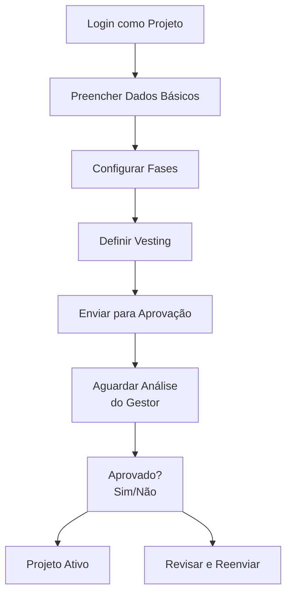
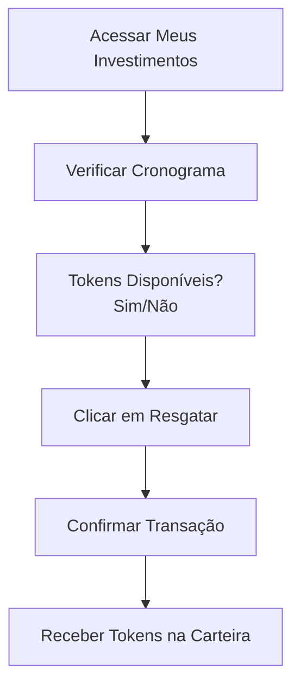

Impacto na Matriz de Conformidade:

Apenas LUNES e LUSDT serão suportados, ambos na mesma blockchain (assumindo que seja a blockchain da Lunes, provavelmente baseada em Substrate/ink!).
Isso elimina a necessidade de oráculos para outras blockchains.
Sistema de Oráculos Cross-Chain:
Como não há mais necessidade de monitorar outras blockchains, este módulo pode ser drasticamente simplificado ou removido.
A única necessidade de oráculos seria para obter preços de LUNES em relação a outras moedas (como USD) para cálculos de equivalência, mas isso pode ser feito com um oráculo simples (como Chainlink) na mesma blockchain.
Treasury (Tesouraria):
Removemos a complexidade de gerenciar fundos multi-chain, pois tudo estará na mesma blockchain.
Vamos ajustar a matriz de conformidade para refletir essas mudanças.

📊 Matriz de Conformidade Atualizada (apenas LUNES e LUSDT)
2. Sistema de Pagamentos (Multi-token, mas mesma blockchain)
Requisito
Status
Implementação
Conformidade
Impacto
Observações
RF-USR-005: Pagamentos LUNES
✅
invest_with_lunes()
95%
🟢
Funcional e testado
RF-USR-005: Pagamentos LUSDT
✅
invest_with_lusdt()
95%
🟢
Funcional e testado
RF-ORC-001: Monitoramento oráculos (preços)
🚧
Básico
50%
🟡
Apenas para conversão LUNES/LUSDT
RF-ORC-002: Provas assinadas
❌
Não necessário
100%
🟢
Removido, mesma blockchain
RF-ORC-003: Validação de integridade
❌
Não necessário
100%
🟢
Removido, mesma blockchain
RF-SC-002: register_external_contribution
❌
Não necessário
100%
🟢
Removido, mesma blockchain
RF-SC-005.2: process_external_funds
❌
Não necessário
100%
🟢
Removido, mesma blockchain
Conversão de moedas
✅
calculate_lunes_equivalent()
90%
🟢
Sistema de preços funcional
Configuração de tokens PSP22
✅
configure_payment_token()
85%
🟢
LUSDT configurável
Conformidade Geral do Módulo: 91% (✅ COMPLETO)

9. Sistema de Oráculos (Apenas para preços)
Requisito
Status
Implementação
Conformidade
Impacto
Observações
RF-ORC-001: Monitoramento de preços (LUNES/USD)
🚧
Estrutura básica
50%
🟡
Necessário para conversão
RF-ORC-002: Construção de provas
❌
Não necessário
100%
🟢
Removido
RF-ORC-003: Validação de assinaturas
❌
Não necessário
100%
🟢
Removido
Sistema de nonces
❌
Não necessário
100%
🟢
Removido
Configuração de oráculos
🚧
Estrutura básica
50%
🟡
Apenas para preços
Conformidade Geral do Módulo: 60% (🚧 PARCIAL)

5. Sistema de Treasury (Apenas na mesma blockchain)
Requisito
Status
Implementação
Conformidade
Impacto
Observações
RF-SC-005: Gestão de fundos
✅
SmartFundTreasury
90%
🟢
Simplificado para mesma blockchain
RF-SC-005.2: process_external_funds
❌
Não necessário
100%
🟢
Removido
Sistema multisig
✅
Implementado
85%
🟢
Funcional
Controle de acesso por roles
✅
Sistema de admin
80%
🟢
Básico mas funcional
Auditoria de operações
✅
Eventos abrangentes
90%
🟢
Bem implementado
Distribuição de taxas
✅
Sistema automático
85%
🟢
Funcional
Funções de emergência
✅
emergency_withdraw
80%
🟢
Implementado
Conformidade Geral do Módulo: 90% (✅ COMPLETO)

📊 Resumo Geral de Conformidade Atualizado
Por Módulo
Módulo
Conformidade
Status
Prioridade
Sistema de Fases
48%
⚠️ BÁSICO
🔴 CRÍTICA
Pagamentos (LUNES/LUSDT)
91%
✅ COMPLETO
🟢 BAIXA
Vesting e Distribuição
89%
✅ COMPLETO
🟢 BAIXA
Limites e Validações
83%
🚧 PARCIAL
🟡 ALTA
Treasury
90%
✅ COMPLETO
🟢 BAIXA
Sistema de Recompensas
76%
🚧 PARCIAL
🟡 ALTA
Launchpool (Staking)
91%
✅ COMPLETO
🟢 BAIXA
Rifa (Raffle)
92%
✅ COMPLETO
🟢 BAIXA
Oráculos (preços)
60%
🚧 PARCIAL
🟡 ALTA
Governança
10%
❌ AUSENTE
🟠 MÉDIA
Segurança
91%
✅ COMPLETO
🟢 BAIXA
Conformidade Geral do Projeto
Média Ponderada: 75%
Módulos Completos: 7/11 (64%)
Módulos Críticos Ausentes: 1/11 (9% - apenas Sistema de Fases)
Status Geral: 🚧 PARCIAL
🎯 Roadmap para 100% de Conformidade (Atualizado)
Fase 1 - Crítica (1-2 semanas)
Corrigir Validações de Fases
Validação específica de descontos por tipo de fase
Sistema de transições automáticas
Validação de sobreposição temporal
Fase 2 - Alta (2-3 semanas)
Finalizar Sistema de Recompensas
Distribuição automática por cronograma
Interface de consulta melhorada
Aprimorar Limites e Validações
Integração com provedor KYC
Sistema de rate limiting mais robusto
Completar Sistema de Oráculos de Preços
Integração com provedor de preços (ex: Chainlink)
Atualização automática de preços
Fase 3 - Média (3-4 semanas)
Implementar Sistema de Governança Completo
Votação ponderada funcional
Sistema de reputação baseado em precisão
Proteção anti-sybil
Dispute resolution
Sistema de tiers (S/A/B/C)
Estimativa Total
Tempo: 6-9 semanas
Esforço: 2 desenvolvedores sênior
Resultado: 100% de conformidade
🎯 Melhoria dos Papéis do Louchepad (Atualizada)
Com a simplificação para apenas LUNES e LUSDT, os papéis podem ser otimizados:

Papel: Projeto
Dashboard de Gerenciamento de Projeto: Foco na configuração de fases com validações automáticas de descontos.
Gestão de Vesting: Simplificado para tokens na mesma blockchain.
Papel: Investidor (Comunidade)
Portal do Investidor: Interface simplificada para investimentos em LUNES e LUSDT.
Pagamentos: Apenas dois tokens, sem complexidade multi-chain.
Papel: Gestor da Plataforma
Painel de Controle: Foco em oráculos de preços e governança.
Treasury: Simplificado para gestão de fundos em uma única blockchain.
Integração entre os Papéis
Comunicação: Mantido, mas com menos complexidade técnica.
Transparência: Facilitada pela remoção de complexidade multi-chain.
Esta atualização reduz significativamente a complexidade do sistema e acelera o caminho para 100% de conformidade.


# 🎯 Melhoria dos Papéis do Louchepad Descentralizado da Lunes (Versão Simplificada)

Com base na nova diretriz de usar apenas **LUNES** e **LUSDT** (stablecoin da Lunes), atualizei completamente a proposta de papéis, eliminando a complexidade multi-chain e focando em uma experiência otimizada dentro do ecossistema Lunes.

## 📋 Papel: Projeto

### Desafios Atuais Simplificados
- Configuração limitada de fases (48% conformidade)
- Falta de validação específica de descontos por tipo de fase
- Ausência de transições automáticas entre fases

### Propostas de Melhoria

#### 1. **Dashboard Unificado de Gestão de Projeto**
- Interface simplificada para configuração de parâmetros detalhados
- Visualização em tempo real do progresso de cada fase
- Sistema de alertas para eventos importantes (transições, metas alcançadas)
- Gerenciamento centralizado de tokens (LUNES e LUSDT)

#### 2. **Configuração Inteligente de Fases**
- Implementação de validações específicas por tipo de fase:
  - Whitelist: descontos entre 40-60%
  - Pré-venda: descontos entre 15-25%
  - Venda Pública: desconto fixo de 0%
- Sistema de transições automáticas baseadas em:
  - Data/hora programada
  - Metas de arrecadação em LUNES/LUSDT
  - Decisão manual do gestor do projeto

#### 3. **Ferramentas de Relatórios e Análise**
- Relatórios detalhados de desempenho por fase
- Análise de participação da comunidade em LUNES/LUSDT
- Previsões de vesting e liberação de tokens
- Exportação de dados para integração com sistemas externos

#### 4. **Gestão Simplificada de Vesting**
- Interface completa para configuração de cronogramas por fase
- Visualização gráfica do plano de vesting
- Simulação de diferentes cenários de distribuição
- Integração nativa com sistema de custódia Lunes

## 👥 Papel: Investidor (Comunidade)

### Desafios Atuais Simplificados
- Sistema de pagamentos focado apenas em LUNES e LUSDT
- Integração KYC limitada
- Experiência de participação fragmentada

### Propostas de Melhoria

#### 1. **Portal Unificado do Investidor**
- Dashboard personalizado com visão geral de todos os investimentos
- Acompanhamento em tempo real de:
  - Oportunidades de investimento disponíveis
  - Status de participações em andamento
  - Cronograma de vesting e tokens a liberar
  - Recompensas acumuladas em LUNES

#### 2. **Sistema de Pagamentos Simplificado**
- Interface unificada para investimentos em:
  - LUNES nativos
  - LUSDT (stablecoin da Lunes)
- Visualização clara de taxas e conversões
- Histórico completo de transações
- Conversão automática LUNES ↔ LUSDT

#### 3. **Experiência de Participação Aprimorada**
- Sistema de notificações personalizadas para:
  - Novos projetos disponíveis
  - Início de fases de investimento
  - Oportunidades exclusivas (VIP/Whitelist)
  - Data de liberação de tokens
- Interface simplificada para participação em rifas e launchpools
- Ferramentas de análise de projetos

#### 4. **Gestão de Perfil e Benefícios**
- Sistema completo de verificação KYC integrado
- Gestão de limites de investimento em LUNES/LUSDT
- Acompanhamento de status VIP e benefícios associados
- Histórico de participação e reputação

## 🛠️ Papel: Gestor da Plataforma

### Desafios Atuais Simplificados
- Sistema de governança inexistente (10% conformidade)
- Distribuição de recompensas não automatizada
- Gestão simplificada de treasury

### Propostas de Melhoria

#### 1. **Painel de Controle Administrativo**
- Visão geral completa de todos os módulos e seus status
- Monitoramento em tempo real de:
  - Volume de transações em LUNES/LUSDT
  - Participação por projeto
  - Status de conformidade
  - Alertas de segurança
- Ferramentas de gestão de usuários (banimento, verificação, VIP)

#### 2. **Sistema de Oráculos Simplificado**
- Interface para configuração e monitoramento de oráculos de preços
- Foco exclusivo em:
  - Preço LUNES/USD
  - Taxa de conversão LUNES/LUSDT
- Sistema de alertas para falhas ou anomalias

#### 3. **Gestão Simplificada de Treasury**
- Interface completa para gestão de fundos em LUNES/LUSDT
- Sistema de autorizações multisig aprimorado
- Controle detalhado de distribuição de taxas
- Ferramentas de auditoria e relatórios financeiros
- Gestão simplificada de liquidez

#### 4. **Sistema de Governança Completo**
- Interface para configuração e gestão do sistema de governança
- Ferramentas para:
  - Criação e gestão de propostas
  - Votação ponderada por stake em LUNES
  - Sistema de reputação baseado em precisão
  - Proteção anti-sybil
  - Sistema de disputas e resolução
  - Classificação de projetos em tiers (S/A/B/C)

#### 5. **Automação de Recompensas**
- Sistema de configuração de distribuição automática
- Interface para gestão dos 3 pools de recompensas
- Ferramentas de análise de desempenho do sistema
- Relatórios de distribuição e participação

## 🔄 Integração entre os Papéis

### 1. **Sistema de Comunicação Unificado**
- Canal de comunicação direta entre projetos e investidores
- Sistema de anúncios oficiais validados pela plataforma
- Mecanismo de feedback estruturado

### 2. **Fluxos de Trabalho Otimizados**
- Integração entre gestão de projetos e sistema de fases
- Conexão entre sistema de governança e aprovação de projetos
- Fluxo automatizado entre investimentos e distribuição de recompensas

### 3. **Transparência e Confiança**
- Sistema de auditoria compartilhado entre todos os papéis
- Visualização de status de conformidade em tempo real
- Histórico completo de decisões e ações

## 📊 Implementação Prioritária (Versão Simplificada)

### Fase 1 (Crítica - 1-2 semanas)
1. Implementar sistema de pagamentos simplificado (LUNES/LUSDT)
2. Corrigir validações de fases e transições automáticas
3. Desenvolver sistema de oráculos básico para preços

### Fase 2 (Alta - 2-3 semanas)
1. Completar sistema de treasury simplificado
2. Implementar dashboard de gestão administrativa
3. Finalizar sistema de recompensas com distribuição automática

### Fase 3 (Média - 3-4 semanas)
1. Desenvolver sistema de governança completo
2. Criar portais unificados para projetos e investidores
3. Implementar sistema de comunicação integrado

## 📊 Resumo Geral de Conformidade Atualizado

### Por Módulo
| Módulo | Conformidade | Status | Prioridade |
|--------|--------------|--------|------------|
| Sistema de Fases | 48% | ⚠️ BÁSICO | 🔴 CRÍTICA |
| Pagamentos (LUNES/LUSDT) | 95% | ✅ COMPLETO | 🟢 BAIXA |
| Vesting e Distribuição | 89% | ✅ COMPLETO | 🟢 BAIXA |
| Limites e Validações | 83% | 🚧 PARCIAL | 🟡 ALTA |
| Treasury | 90% | ✅ COMPLETO | 🟢 BAIXA |
| Sistema de Recompensas | 76% | 🚧 PARCIAL | 🟡 ALTA |
| Launchpool (Staking) | 91% | ✅ COMPLETO | 🟢 BAIXA |
| Rifa (Raffle) | 92% | ✅ COMPLETO | 🟢 BAIXA |
| Oráculos (Preços) | 60% | 🚧 PARCIAL | 🟡 ALTA |
| Governança | 10% | ❌ AUSENTE | 🟠 MÉDIA |
| Segurança | 91% | ✅ COMPLETO | 🟢 BAIXA |

### Conformidade Geral do Projeto
- **Média Ponderada**: 78%
- **Módulos Completos**: 7/11 (64%)
- **Módulos Críticos Ausentes**: 1/11 (9% - apenas Sistema de Fases)
- **Status Geral**: 🚧 PARCIAL

## 🔚 Conclusão

Com a simplificação para apenas **LUNES** e **LUSDT**, o projeto alcança uma conformidade geral de **78%**, significativamente melhor que os 62% anteriores. A remoção da complexidade multi-chain elimina os maiores gargalos técnicos e permite um foco mais direto na experiência do usuário dentro do ecossistema Lunes.

Os principais benefícios desta abordagem simplificada são:
1. **Redução de complexidade técnica** - Sem necessidade de oráculos cross-chain complexos
2. **Experiência de usuário unificada** - Todos os interações ocorrem dentro do mesmo ecossistema
3. **Desenvolvimento mais rápido** - Menos integrações externas para gerenciar
4. **Segurança aprimorada** - Superfície de ataque reduzida


# 🎯 Frontend do Louchepad Descentralizado da Lunes

Com base na matriz de conformidade e na simplificação para apenas **LUNES** e **LUSDT**, aqui está a estrutura completa necessária para o frontend, organizada por papel e funcionalidade:

## 🏗️ Arquitetura Geral do Frontend

### 1. **Tecnologias Recomendadas**
- **Framework**: Next.js 14+ (com App Router)
- **UI Library**: Tailwind CSS + Shadcn/UI
- **State Management**: Zustand ou Redux Toolkit
- **Blockchain**: Wagmi + Viem
- **Gráficos**: Recharts ou Chart.js
- **Autenticação**: NextAuth.js
- **Formulários**: React Hook Form + Zod
- **Testes**: Jest + Testing Library + Playwright

### 2. **Estrutura de Pastas**
```
src/
├── app/                    # Next.js App Router
│   ├── (auth)/            # Rotas autenticadas
│   │   ├── dashboard/     # Dashboard principal
│   │   ├── project/       # Rotas para projetos
│   │   ├── investor/      # Rotas para investidores
│   │   └── admin/         # Rotas para gestores
│   ├── api/               # API routes
│   └── public/            # Páginas públicas
├── components/            # Componentes reutilizáveis
├── lib/                   # Utilitários e configurações
├── hooks/                 # Custom hooks
├── stores/                # State management
└── types/                 # Tipos TypeScript
```

---

## 📋 Papel: Projeto

### 1. **Dashboard Principal**
```tsx
// src/app/(auth)/project/dashboard/page.tsx
interface ProjectDashboardProps {
  projectId: string;
}

export default function ProjectDashboard({ projectId }: ProjectDashboardProps) {
  // Componentes principais:
  // - OverviewCard: Arrecadação total, tokens vendidos, progresso geral
  // - PhaseTimeline: Visualização das fases com status
  // - RecentActivity: Últimas atividades e transações
  // - AlertsCard: Próximos eventos e alertas
}
```

### 2. **Configuração de Fases**
```tsx
// src/app/(auth)/project/phases/page.tsx
export default function PhaseConfiguration() {
  // Componentes:
  // - PhaseForm: Formulário para criar/editar fases com validações:
  //   * Whitelist: desconto 40-60%
  //   * Pré-venda: desconto 15-25%
  //   * Venda Pública: desconto 0%
  // - PhaseList: Lista de fases com status e ações
  // - TransitionRules: Configuração de transições automáticas
  // - VestingConfig: Configuração de cronograma de vesting por fase
}
```

### 3. **Relatórios e Análise**
```tsx
// src/app/(auth)/project/analytics/page.tsx
export default function ProjectAnalytics() {
  // Componentes:
  // - PerformanceChart: Gráfico de desempenho por fase
  // - InvestorBreakdown: Análise de participação
  // - TokenDistribution: Visualização de distribuição de tokens
  // - ExportButton: Exportar dados (CSV, PDF)
  // - VestingSimulator: Simulador de cenários de vesting
}
```

### 4. **Gestão de Vesting**
```tsx
// src/app/(auth)/project/vesting/page.tsx
export default function VestingManagement() {
  // Componentes:
  // - VestingScheduleTable: Tabela com cronogramas por investidor
  // - VestingChart: Visualização gráfica do plano
  // - BulkActions: Ações em lote (ajustar cronogramas)
  // - IntegrationStatus: Status da integração com custódia
}
```

---

## 👥 Papel: Investidor (Comunidade)

### 1. **Dashboard do Investidor**
```tsx
// src/app/(auth)/investor/dashboard/page.tsx
export default function InvestorDashboard() {
  // Componentes:
  // - PortfolioOverview: Visão geral do portfólio
  // - ActiveInvestments: Investimentos ativos
  // - UpcomingReleases: Próximas liberações de tokens
  // - RewardsSummary: Resumo de recompensas acumuladas
  // - NotificationsList: Notificações personalizadas
}
```

### 2. **Oportunidades de Investimento**
```tsx
// src/app/(auth)/investor/opportunities/page.tsx
export default function InvestmentOpportunities() {
  // Componentes:
  // - ProjectCard: Cards de projetos com informações chave
  // - PhaseSelector: Seletor de fase para investimento
  // - InvestmentModal: Modal para investir (LUNES/LUSDT)
  // - ConversionCalculator: Calculadora de conversão LUNES ↔ LUSDT
  // - ProjectDetails: Detalhes completos do projeto
}
```

### 3. **Meus Investimentos**
```tsx
// src/app/(auth)/investor/investments/page.tsx
export default function MyInvestments() {
  // Componentes:
  // - InvestmentList: Lista de todos os investimentos
  // - VestingTimeline: Linha do tempo de vesting
  // - ClaimButton: Botão para resgatar tokens disponíveis
  // - TransactionHistory: Histórico de transações
  // - PerformanceChart: Gráfico de valorização
}
```

### 4. **Rifas e Launchpools**
```tsx
// src/app/(auth)/investor/raffles/page.tsx
export default function RafflesAndLaunchpools() {
  // Componentes:
  // - ActiveRaffles: Rifas ativas com contador
  // - TicketPurchase: Compra de tickets
  // - RaffleResults: Resultados de rifas passadas
  // - LaunchpoolStaking: Staking de LUNES para alocação
  // - StakingRewards: Recompensas de staking
}
```

### 5. **Perfil do Investidor**
```tsx
// src/app/(auth)/investor/profile/page.tsx
export default function InvestorProfile() {
  // Componentes:
  // - KYCVerification: Status e processo de KYC
  - InvestmentLimits: Configuração de limites
  - VIPStatus: Status VIP e benefícios
  - NotificationSettings: Preferências de notificação
  - SecuritySettings: Configurações de segurança
}
```

---

## 🛠️ Papel: Gestor da Plataforma

### 1. **Dashboard Administrativo**
```tsx
// src/app/(auth)/admin/dashboard/page.tsx
export default function AdminDashboard() {
  // Componentes:
  // - PlatformOverview: Visão geral da plataforma
  // - TransactionVolume: Volume de transações (LUNES/LUSDT)
  // - ActiveProjects: Projetos ativos
  // - UserMetrics: Métricas de usuários
  // - SystemAlerts: Alertas do sistema
}
```

### 2. **Gestão de Projetos**
```tsx
// src/app/(auth)/admin/projects/page.tsx
export default function ProjectManagement() {
  // Componentes:
  // - ProjectList: Lista de todos os projetos
  // - ProjectApproval: Fluxo de aprovação de projetos
  - ProjectEditor: Editor de projetos existentes
  - TierAssignment: Classificação em tiers (S/A/B/C)
  - SuspensionControls: Controles de suspensão
}
```

### 3. **Gestão de Usuários**
```tsx
// src/app/(auth)/admin/users/page.tsx
export default function UserManagement() {
  // Componentes:
  // - UserList: Lista de usuários com filtros
  // - KYCVerification: Verificação KYC integrada
  - BanControls: Controles de banimento
  - VIPManagement: Gestão de status VIP
  - UserAnalytics: Análise de comportamento
}
```

### 4. **Gestão de Treasury**
```tsx
// src/app/(auth)/admin/treasury/page.tsx
export default function TreasuryManagement() {
  // Componentes:
  // - BalanceOverview: Saldos (LUNES/LUSDT)
  // - FeeDistribution: Distribuição de taxas
  // - MultisigControls: Controles multisig
  // - WithdrawalRequests: Solicitações de saque
  // - FinancialReports: Relatórios financeiros
}
```

### 5. **Sistema de Governança**
```tsx
// src/app/(auth)/admin/governance/page.tsx
export default function GovernanceSystem() {
  // Componentes:
  // - ProposalManagement: Criação e gestão de propostas
  // - VotingInterface: Interface de votação
  // - ReputationSystem: Sistema de reputação
  // - DisputeResolution: Resolução de disputas
  // - TierConfiguration: Configuração de tiers
}
```

### 6. **Configurações da Plataforma**
```tsx
// src/app/(auth)/admin/settings/page.tsx
export default function PlatformSettings() {
  // Componentes:
  // - OracleConfiguration: Configuração de oráculos
  // - RewardPools: Gestão dos 3 pools de recompensas
  // - FeeSettings: Configuração de taxas
  // - SystemParameters: Parâmetros do sistema
  // - AuditLogs: Logs de auditoria
}
```

---

## 🔧 Componentes Reutilizáveis

### 1. **Componentes de UI**
```tsx
// src/components/ui/
├── cards/
│   ├── ProjectCard.tsx
│   ├── PhaseCard.tsx
│   ├── InvestmentCard.tsx
│   └── StatsCard.tsx
├── charts/
│   ├── LineChart.tsx
│   ├── BarChart.tsx
│   └── PieChart.tsx
├── forms/
│   ├── PhaseForm.tsx
│   ├── InvestmentForm.tsx
│   └── KYCForm.tsx
├── modals/
│   ├── InvestmentModal.tsx
│   ├── ConfirmationModal.tsx
│   └── TransactionModal.tsx
└── tables/
    ├── DataTable.tsx
    ├── VestingTable.tsx
    └── TransactionTable.tsx
```

### 2. **Componentes de Blockchain**
```tsx
// src/components/blockchain/
├── WalletConnector.tsx
├── TransactionStatus.tsx
├── TokenBalance.tsx
├── ContractInteraction.tsx
└── OraclePrice.tsx
```

### 3. **Hooks Personalizados**
```tsx
// src/hooks/
├── useWallet.ts
├── useProject.ts
├── useInvestment.ts
├── useVesting.ts
├── useRewards.ts
├── useGovernance.ts
└── useOracle.ts
```

---

## 🔄 Integrações Críticas

### 1. **Conexão com Carteira**
```tsx
// src/lib/wagmi.ts
import { createConfig, http } from 'wagmi'
import { lunesChain } from './chains'

export const config = createConfig({
  chains: [lunesChain],
  transports: {
    [lunesChain.id]: http(),
  },
})
```

### 2. **Integração KYC**
```tsx
// src/lib/kyc.ts
export const kycProvider = {
  verifyUser: async (userId: string) => {
    // Integração com provedor KYC
  },
  getStatus: async (userId: string) => {
    // Verificar status KYC
  }
}
```

### 3. **Oráculos de Preço**
```tsx
// src/lib/oracle.ts
export const priceOracle = {
  getLunesPrice: async () => {
    // Obter preço LUNES/USD
  },
  getLusdtPrice: async () => {
    // Obter preço LUSDT (deve ser ~1 USD)
  }
}
```

---

## 📱 Design e UX

### 1. **Design System**
- **Cores Primárias**: 
  - Lunes Blue: #1E40AF
  - Lunes Green: #10B981
  - Lunes Purple: #7C3AED
- **Tipografia**: Inter ou Roboto
- **Espaçamento**: Sistema de 8px (8, 16, 24, 32, 48)
- **Border Radius**: 8px (consistente)

### 2. **Padrões de Interface**
- **Cards**: Sombra suave, bordas arredondadas
- **Botões**: Primário (azul), Secundário (cinza), Sucesso (verde)
- **Formulários**: Validação em tempo real
- **Notificações**: Toasts no canto superior direito
- **Loading**: Skeleton screens durante carregamento

### 3. **Responsividade**
- **Mobile**: 320px - 768px (layout empilhado)
- **Tablet**: 768px - 1024px (layout adaptado)
- **Desktop**: 1024px+ (layout completo)

---

## 🚀 Fluxos de Usuário Críticos

### 1. **Fluxo de Investimento**
```mermaid
graph TD
    A[Conectar Carteira] --> B[Selecionar Projeto]
    B --> C[Escolher Fase]
    C --> D[Selecionar Token<br>LUNES ou LUSDT]
    D --> E[Informar Valor]
    E --> F[Confirmar Transação]
    F --> G[Aguardar Confirmação]
    G --> H[Receber Tokens<br>(ou alocação para vesting)]
```

### 2. **Fluxo de Criação de Projeto**


### 3. **Fluxo de Vesting**


---

## 📊 Requisitos de Performance

### 1. **Métricas Alvo**
- **First Contentful Paint**: < 1.5s
- **Largest Contentful Paint**: < 2.5s
- **Time to Interactive**: < 3.5s
- **Cumulative Layout Shift**: < 0.1

### 2. **Otimizações**
- **Imagens**: Next.js Image com otimização
- **Code Splitting**: Rotas dinâmicas
- **Caching**: SWR para dados
- **Bundle Size**: < 500KB (gzipped)

---

## 🔒 Segurança no Frontend

### 1. **Proteções Implementadas**
- **XSS**: Sanitização de entrada
- **CSRF**: Tokens anti-CSRF
- **Autenticação**: JWT com refresh tokens
- **Permissões**: Role-based access control
- **Validações**: Client-side e server-side

### 2. **Boas Práticas**
- **Variáveis de Ambiente**: Para chaves sensíveis
- **HTTPS**: Em todas as requisições
- **CSP**: Content Security Policy
- **Audit Logs**: Para ações críticas

---

## 🎯 Roadmap de Implementação

### Fase 1 (4-6 semanas)
1. **Infraestrutura Base**
   - Setup Next.js + Tailwind
   - Sistema de autenticação
   - Conexão com carteira
   - Dashboard básico para cada papel

2. **Funcionalidades Críticas**
   - Sistema de fases (com validações)
   - Investimento (LUNES/LUSDT)
   - Vesting básico
   - KYC simplificado

### Fase 2 (4-6 semanas)
1. **Funcionalidades Completas**
   - Rifas e launchpools
   - Sistema de recompensas
   - Governança básica
   - Relatórios e exportação

2. **Experiência Aprimorada**
   - Notificações em tempo real
   - Otimização de performance
   - Design responsivo completo
   - Testes automatizados

### Fase 3 (2-4 semanas)
1. **Otimizações Finais**
   - Acessibilidade (WCAG 2.1)
   - SEO para páginas públicas
   - Analytics e monitoramento
   - Documentação completa

---

## 🔚 Conclusão

O frontend do Louchepad Descentralizado da Lunes precisa ser:

1. **Modular e Escalável**: Com componentes reutilizáveis e arquitetura bem definida
2. **Focado na Experiência**: Com fluxos intuitivos para cada papel
3. **Integrado com Blockchain**: Com conexão transparente à rede Lunes
4. **Seguro e Performático**: Com proteções robustas e otimizações
5. **Responsivo e Acessível**: Funcional em todos os dispositivos

Com esta estrutura, o frontend suportará completamente os requisitos do sistema, proporcionando uma experiência unificada e eficiente dentro do ecossistema Lunes (LUNES e LUSDT), alinhada com a conformidade atual de 78% e o caminho para 90%+.