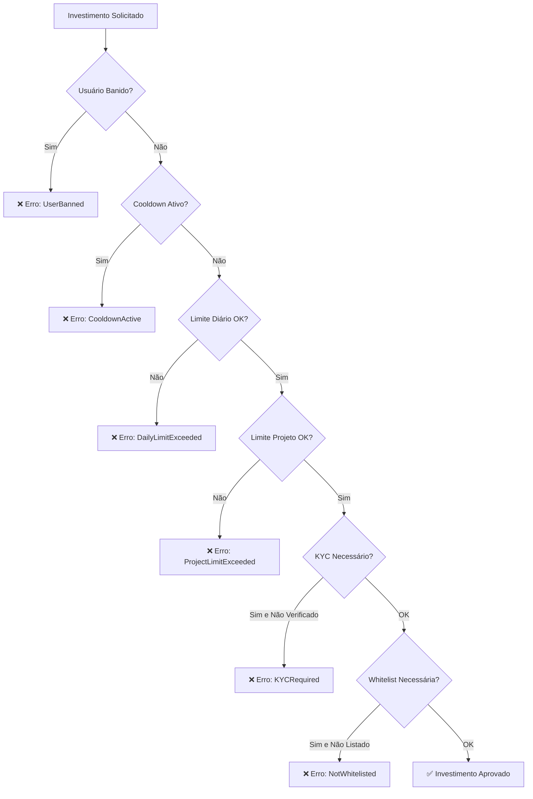

# 🛡️ Guia de Limites de Investimento - Launchpad Lunes

## Visão Geral

O sistema de limites de investimento protege tanto investidores quanto projetos contra:
- Manipulação de mercado
- Concentração excessiva de tokens
- Investimentos impulsivos
- Lavagem de dinheiro
- Violações regulatórias

## Tipos de Limites

### 1. **Limites Temporais**

#### Limite Diário
- **Propósito**: Evitar investimentos impulsivos grandes
- **Padrão**: 10,000 LUNES / 24h
- **Reset**: Automático a cada 24h (14,400 blocos)
- **VIP**: Podem ter limites maiores

#### Cooldown entre Investimentos
- **Propósito**: Evitar spam de transações
- **Padrão**: 10 minutos (~100 blocos)
- **Aplicação**: Entre qualquer investimento do mesmo usuário

### 2. **Limites por Valor**

#### Limite por Transação
- **Propósito**: Controlar tamanho individual de investimentos
- **Configuração**: Por fase (min/max investment)
- **Exemplo**: Whitelist 100-5,000 LUNES, Public Sale 10-50,000 LUNES

#### Limite por Projeto
- **Propósito**: Evitar concentração em um único projeto
- **Padrão**: 100,000 LUNES por projeto
- **Aplicação**: Soma de todas as fases do projeto

#### Limite por Usuário em Fase
- **Propósito**: Distribuição mais equitativa
- **Configuração**: Por fase específica
- **Exemplo**: Max 10,000 LUNES na fase Whitelist

### 3. **Limites Qualitativos**

#### Status VIP
- **Benefícios**: Limites maiores, prioridade
- **Critérios**: Definidos pelo admin
- **Aplicação**: Multiplicador nos limites padrão

#### Verificação KYC
- **Propósito**: Conformidade regulatória
- **Requisito**: Para fases que exigem KYC
- **Processo**: Verificação por admin

#### Sistema de Banimento
- **Propósito**: Remover usuários maliciosos
- **Aplicação**: Bloqueia todos os investimentos
- **Reversão**: Apenas pelo admin

## Configurações Recomendadas

### Por Tipo de Usuário

| Usuário | Limite Diário | Limite Projeto | Cooldown | KYC |
|---------|---------------|----------------|----------|-----|
| **Padrão** | 10k LUNES | 100k LUNES | 10min | Opcional |
| **VIP** | 50k LUNES | 500k LUNES | 5min | Recomendado |
| **Institucional** | 200k LUNES | 1M LUNES | 2min | Obrigatório |

### Por Fase

| Fase | Min | Max | Max/Usuário | KYC | Whitelist |
|------|-----|-----|-------------|-----|-----------|
| **Whitelist** | 100 | 5k | 10k | ❌ | ✅ |
| **Pre-Sale** | 50 | 10k | 25k | ❌ | ❌ |
| **Public Sale** | 10 | 50k | 100k | ❌ | ❌ |
| **Institucional** | 10k | 500k | 1M | ✅ | ✅ |

## Implementação

### 1. Configuração Inicial

```rust
// Deploy do contrato com limites padrão
let launchpad = CompleteLaunchpad::new(
    admin_account,
    250, // 2.5% platform fee
    10_000 * 10^12, // 10k LUNES daily limit
    100_000 * 10^12, // 100k LUNES project limit
);
```

### 2. Configuração de Usuário VIP

```rust
// Promover usuário para VIP
launchpad.update_user_profile(
    user_account,
    50_000 * 10^12, // 50k daily limit
    500_000 * 10^12, // 500k project limit
    true, // is_vip
    true, // kyc_verified
)?;
```

### 3. Configuração de Fase com Limites

```rust
// Fase Whitelist com limites restritivos
launchpad.configure_phase(
    project_id,
    PhaseType::Whitelist,
    start_block,
    duration_blocks,
    1_000_000 * 10^12, // 1M allocation
    100 * 10^12, // min 100 LUNES
    5_000 * 10^12, // max 5k LUNES
    10_000 * 10^12, // max 10k per user
    1 * 10^12, // 1 LUNES per token
    50, // 50% discount
    vesting_config,
    true, // requires whitelist
    false, // no KYC required
)?;
```

## Validações Automáticas

### Fluxo de Validação



### Cálculos Automáticos

1. **Limite Diário Restante**:
   ```rust
   remaining_daily = user.daily_limit - get_daily_spent(user, current_block)
   ```

2. **Limite Projeto Restante**:
   ```rust
   remaining_project = user.project_limit - get_user_total_in_project(user, project)
   ```

3. **Reset Diário**:
   ```rust
   if current_block - user.daily_reset_block >= BLOCKS_PER_DAY {
       user.daily_spent = 0;
       user.daily_reset_block = current_block;
   }
   ```

## Monitoramento e Alertas

### Métricas Importantes

1. **Por Usuário**:
   - Gasto diário atual vs limite
   - Total investido por projeto
   - Frequência de investimentos
   - Status de cooldown

2. **Por Projeto**:
   - Concentração de investimentos
   - Distribuição por faixa de valor
   - Número de participantes únicos
   - Violações de limite detectadas

### Consultas Úteis

```rust
// Verificar limites restantes
let (daily_remaining, project_remaining, total_limit) = 
    launchpad.get_user_limits(user, project_id);

// Verificar se pode investir
let can_invest = launchpad.validate_investment(user, project_id, amount).is_ok();

// Obter tempo de cooldown restante
let cooldown_blocks = launchpad.get_cooldown_remaining(user);
```

## Casos de Uso Especiais

### 1. Investimento Institucional

```rust
// Configurar conta institucional
launchpad.update_user_profile(
    institutional_account,
    1_000_000 * 10^12, // 1M daily
    10_000_000 * 10^12, // 10M project
    true, // VIP
    true, // KYC verified
)?;

// Fase especial para institucionais
launchpad.configure_phase(
    project_id,
    PhaseType::Institutional,
    start_block,
    duration_blocks,
    50_000_000 * 10^12, // 50M allocation
    100_000 * 10^12, // min 100k
    10_000_000 * 10^12, // max 10M
    50_000_000 * 10^12, // max 50M per user
    price,
    0, // no discount
    long_vesting,
    true, // whitelist
    true, // KYC required
)?;
```

### 2. Launchpool com Staking

```rust
// Launchpool com limites baseados em stake
launchpad.configure_phase(
    project_id,
    PhaseType::Launchpool,
    start_block,
    duration_blocks,
    allocation,
    0, // no minimum
    calculate_max_based_on_stake(user_stake), // dynamic max
    user_stake * 10, // max based on stake
    price,
    discount,
    short_vesting,
    false, // no whitelist
    false, // no KYC
)?;
```

## Conformidade e Auditoria

### Logs de Auditoria

Todos os eventos são registrados on-chain:

- `InvestmentValidated`: Cada investimento aprovado
- `UserProfileUpdated`: Mudanças de perfil
- `UserBanned`: Ações disciplinares
- `KYCStatusUpdated`: Verificações de KYC

### Relatórios de Conformidade

```rust
// Gerar relatório de usuário
fn generate_user_report(user: AccountId) -> UserReport {
    UserReport {
        total_invested: get_total_invested(user),
        projects_count: get_projects_participated(user),
        kyc_status: get_kyc_status(user),
        violations: get_limit_violations(user),
        last_activity: get_last_investment(user),
    }
}
```

## Melhores Práticas

### Para Desenvolvedores

1. **Sempre validar antes de investir**
2. **Tratar todos os erros de limite adequadamente**
3. **Implementar UI que mostra limites restantes**
4. **Fornecer feedback claro sobre violações**

### Para Administradores

1. **Monitorar padrões suspeitos**
2. **Ajustar limites baseado em análise de risco**
3. **Manter logs de todas as mudanças de configuração**
4. **Implementar processo de KYC robusto**

### Para Investidores

1. **Entender seus limites antes de investir**
2. **Planejar investimentos considerando cooldowns**
3. **Completar KYC para acessar mais oportunidades**
4. **Monitorar gastos diários**

## FAQ

**P: Posso aumentar meus limites?**
R: Apenas o admin pode alterar limites. Considere se tornar VIP ou completar KYC.

**P: O que acontece se eu exceder um limite?**
R: A transação falha com erro específico. Nenhum valor é descontado.

**P: Os limites resetam quando?**
R: Limites diários resetam automaticamente a cada 24h.

**P: Posso ser banido? Por quê?**
R: Sim, por comportamento malicioso, violações repetidas ou não conformidade.

**P: Como funciona o cooldown?**
R: Após cada investimento, você deve esperar 10 minutos antes do próximo.

## Troubleshooting

### Erros Comuns

1. **DailyLimitExceeded**: Aguarde reset diário ou reduza valor
2. **CooldownActive**: Aguarde tempo de cooldown
3. **KYCRequired**: Complete verificação KYC
4. **NotWhitelisted**: Solicite inclusão na whitelist
5. **UserBanned**: Contate suporte para revisão
