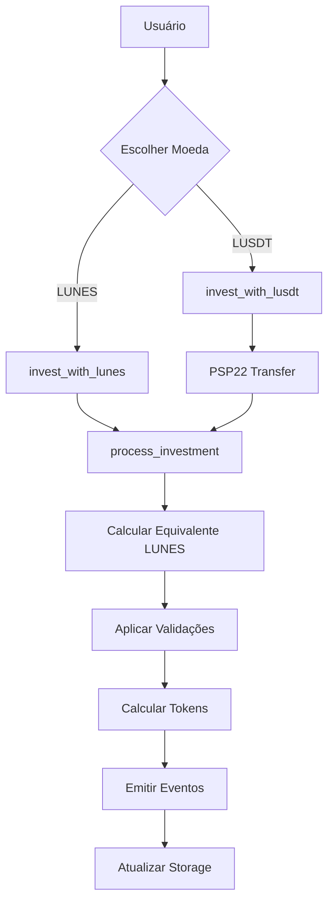

# 💰 Guia de Pagamentos Multi-Moeda - Launchpad Lunes

## Visão Geral

O Launchpad Lunes suporta pagamentos em múltiplas moedas para democratizar o acesso aos investimentos e oferecer flexibilidade aos usuários:

- **LUNES** - Moeda nativa da rede (pagamentos diretos)
- **LUSDT** - Lunes USD Token (token PSP22 estável)
- **Extensível** - Sistema preparado para novos tokens

## Arquitetura do Sistema

### Componentes Principais



### Fluxo de Conversão

1. **Entrada**: Valor em moeda escolhida
2. **Conversão**: Para equivalente em LUNES
3. **Validação**: Limites baseados em LUNES
4. **Cálculo**: Tokens baseados em valor LUNES
5. **Registro**: Eventos com ambos os valores

## Configuração de Tokens

### Configurar LUSDT

```rust
// Admin configura LUSDT
launchpad.configure_payment_token(
    PaymentCurrency::LUSDT,
    lusdt_contract_address,
    6, // decimals
    2_000_000, // 2 LUSDT = 1 LUNES (rate)
)?;
```

### Parâmetros da Taxa

- **rate_to_lunes**: Quantos tokens = 1 LUNES
- **Exemplo**: rate = 2_000_000 significa 2 LUSDT = 1 LUNES
- **Cálculo**: `lunes_equivalent = (lusdt_amount * 10^12) / rate`

## Como Investir

### Pagamento em LUNES (Nativo)

```rust
// Usuário envia LUNES junto com a chamada
#[ink(message, payable)]
launchpad.invest_with_lunes(project_id, phase_type)?;
```

**Processo:**
1. LUNES enviado via `transferred_value()`
2. Validações aplicadas diretamente
3. Taxa deduzida em LUNES
4. Tokens calculados e alocados

### Pagamento em LUSDT (PSP22)

```rust
// 1. Usuário aprova allowance no contrato LUSDT
lusdt_contract.approve(launchpad_address, amount)?;

// 2. Launchpad executa a transferência
launchpad.invest_with_lusdt(project_id, phase_type, amount)?;
```

**Processo:**
1. Verificar configuração do LUSDT
2. Executar `transfer_from` PSP22
3. Converter para equivalente LUNES
4. Aplicar validações em LUNES
5. Calcular tokens baseado em valor LUNES

## Cálculos e Conversões

### Fórmulas de Conversão

```rust
// LUSDT para LUNES
lunes_equivalent = (lusdt_amount * 10^12) / rate_to_lunes

// LUNES para LUSDT
lusdt_equivalent = (lunes_amount * rate_to_lunes) / 10^12
```

### Exemplo Prático

**Configuração:**
- Taxa: 2,000,000 (2 LUSDT = 1 LUNES)
- LUSDT decimals: 6
- LUNES decimals: 12

**Conversões:**
```rust
// 10 LUSDT = ? LUNES
lusdt_amount = 10 * 10^6 = 10_000_000
lunes_equiv = (10_000_000 * 10^12) / 2_000_000 = 5 * 10^12 = 5 LUNES

// 5 LUNES = ? LUSDT  
lunes_amount = 5 * 10^12
lusdt_equiv = (5 * 10^12 * 2_000_000) / 10^12 = 10_000_000 = 10 LUSDT
```

## Validações de Segurança

### Validações por Moeda

| Validação | LUNES | LUSDT |
|-----------|-------|-------|
| **Saldo** | Balance nativo | `balance_of()` PSP22 |
| **Transferência** | `transferred_value()` | `transfer_from()` |
| **Allowance** | N/A | Verificação obrigatória |
| **Limites** | Valor direto | Equivalente LUNES |

### Verificações PSP22

```rust
fn validate_lusdt_payment(user: AccountId, amount: Balance) -> Result<(), Error> {
    // 1. Verificar configuração
    let config = get_lusdt_config()?;
    
    // 2. Verificar saldo
    let balance = psp22_balance_of(config.contract_address, user);
    ensure!(balance >= amount, Error::InsufficientBalance);
    
    // 3. Verificar allowance
    let allowance = psp22_allowance(config.contract_address, user, self_address);
    ensure!(allowance >= amount, Error::InsufficientAllowance);
    
    // 4. Executar transferência
    let success = psp22_transfer_from(config.contract_address, user, self_address, amount);
    ensure!(success, Error::TransferFailed);
    
    Ok(())
}
```

## Gestão de Taxas

### Cobrança por Moeda

**LUNES:**
- Taxa cobrada em LUNES
- Transferência direta para `fee_recipient`
- Disponível imediatamente

**LUSDT:**
- Taxa calculada em equivalente LUNES
- LUSDT mantido no contrato
- Admin pode sacar via `withdraw_fees()`

### Saque de Taxas

```rust
// Sacar taxas em LUNES
launchpad.withdraw_fees(PaymentCurrency::LUNES, amount)?;

// Sacar taxas em LUSDT  
launchpad.withdraw_fees(PaymentCurrency::LUSDT, amount)?;
```

## Eventos e Auditoria

### Evento de Investimento

```rust
#[ink(event)]
pub struct InvestmentMade {
    investor: AccountId,
    project_id: Hash,
    phase_type: u8,
    payment_currency: PaymentCurrency, // LUNES ou LUSDT
    payment_amount: Balance,           // Valor original
    equivalent_lunes: Balance,         // Valor convertido
    tokens_allocated: Balance,         // Tokens recebidos
    discount_applied: u8,              // Desconto da fase
}
```

### Rastreabilidade

- **payment_currency**: Moeda usada
- **payment_amount**: Valor original pago
- **equivalent_lunes**: Valor convertido para cálculos
- **tokens_allocated**: Tokens finais alocados

## Consultas e Relatórios

### APIs de Consulta

```rust
// Moedas suportadas
let currencies = launchpad.get_supported_currencies();
// Retorna: [LUNES, LUSDT]

// Configuração de token
let config = launchpad.get_payment_token_config(PaymentCurrency::LUSDT);

// Taxas de câmbio atuais
let rates = launchpad.get_exchange_rates();
// Retorna: [(LUNES, 10^12), (LUSDT, 2_000_000)]

// Calcular equivalente
let lunes_value = launchpad.calculate_lunes_equivalent(PaymentCurrency::LUSDT, lusdt_amount);
let lusdt_value = launchpad.calculate_lusdt_equivalent(lunes_amount);
```

### Relatórios de Volume

```rust
// Volume por moeda (implementação sugerida)
fn get_volume_by_currency(project_id: Hash) -> Vec<(PaymentCurrency, Balance)> {
    // Analisar eventos InvestmentMade
    // Agrupar por payment_currency
    // Somar payment_amount por moeda
}
```

## Integração Frontend

### Seletor de Moeda

```javascript
// Exemplo em JavaScript
const supportedCurrencies = await launchpad.get_supported_currencies();

// Mostrar opções ao usuário
const currencySelector = supportedCurrencies.map(currency => ({
    value: currency,
    label: currency === 'LUNES' ? 'LUNES (Nativo)' : 'LUSDT (Estável)'
}));
```

### Calculadora de Conversão

```javascript
// Conversão em tempo real
async function calculateEquivalent(fromCurrency, amount) {
    if (fromCurrency === 'LUNES') {
        return amount; // 1:1
    } else {
        return await launchpad.calculate_lunes_equivalent('LUSDT', amount);
    }
}
```

### Fluxo de Investimento

```javascript
async function invest(currency, amount, projectId, phaseType) {
    if (currency === 'LUNES') {
        // Pagamento nativo
        return await launchpad.invest_with_lunes(projectId, phaseType, {
            value: amount
        });
    } else {
        // Primeiro aprovar allowance
        await lusdtContract.approve(launchpadAddress, amount);
        
        // Depois investir
        return await launchpad.invest_with_lusdt(projectId, phaseType, amount);
    }
}
```

## Configurações Recomendadas

### Taxa LUSDT/LUNES

| Cenário | Taxa | Descrição |
|---------|------|-----------|
| **Estável** | 1:1 | LUSDT pareado com USD, LUNES = $1 |
| **Premium LUNES** | 2:1 | LUNES = $2, 2 LUSDT = 1 LUNES |
| **Volátil** | Dinâmica | Atualizada via oracle ou admin |

### Limites Sugeridos

```rust
// Configuração típica
configure_payment_token(
    PaymentCurrency::LUSDT,
    lusdt_address,
    6,                    // decimals USDT padrão
    1_000_000,           // 1:1 (1 LUSDT = 1 LUNES)
);
```

## Segurança e Boas Práticas

### Validações Críticas

1. **Sempre verificar allowance** antes de `transfer_from`
2. **Validar saldo PSP22** antes da transferência
3. **Usar try_invoke** para chamadas PSP22 com tratamento de erro
4. **Aplicar limites baseados em LUNES** para consistência
5. **Emitir eventos detalhados** para auditoria

### Proteções Implementadas

```rust
// Proteção contra reentrância (via ink!)
// Proteção contra overflow (métodos checked_)
// Validação de configuração de token
// Rollback automático em caso de falha PSP22
// Eventos completos para rastreabilidade
```

### Cenários de Falha

| Erro | Causa | Solução |
|------|-------|---------|
| `TransferFailed` | Allowance insuficiente | Aumentar approve |
| `InsufficientBalance` | Saldo LUSDT baixo | Depositar LUSDT |
| `TokenNotConfigured` | LUSDT não configurado | Admin configurar |
| `InvalidConfiguration` | Token desabilitado | Admin habilitar |

## Roadmap Futuro

### Próximas Moedas

- **LUSDC** - Lunes USD Coin
- **LBTC** - Lunes Bitcoin
- **LETH** - Lunes Ethereum

### Funcionalidades Avançadas

- **Oracle de preços** para taxas dinâmicas
- **DEX integrado** para swaps automáticos
- **Yield farming** com tokens de pagamento
- **Bridge multichain** para tokens externos

## FAQ

**P: Posso investir parte em LUNES e parte em LUSDT?**
R: Sim, basta fazer investimentos separados. Cada transação pode usar uma moeda diferente.

**P: As taxas são cobradas na moeda que eu pago?**
R: Para LUNES, sim. Para LUSDT, a taxa é calculada em equivalente LUNES.

**P: O vesting é afetado pela moeda de pagamento?**
R: Não, o vesting é sempre calculado em tokens do projeto, independente da moeda usada.

**P: Posso trocar de moeda após investir?**
R: Não, cada investimento é registrado na moeda original. Para usar outra moeda, faça um novo investimento.

**P: Como são calculados os limites com LUSDT?**
R: Convertemos LUSDT para equivalente LUNES e aplicamos os limites em LUNES para consistência.

## Exemplo Completo

```rust
// 1. Deploy e configuração
let launchpad = CompleteLaunchpad::new(admin, 250, daily_limit, project_limit);

// 2. Configurar LUSDT (1:1 com LUNES)
launchpad.configure_payment_token(
    PaymentCurrency::LUSDT,
    lusdt_contract,
    6,
    1_000_000, // 1 LUSDT = 1 LUNES
)?;

// 3. Configurar projeto
launchpad.configure_phase(
    project_id,
    PhaseType::PublicSale,
    start_block,
    duration,
    allocation,
    min_investment,
    max_investment,
    max_per_user,
    price_per_token,
    discount,
    vesting_config,
    false, // sem whitelist
    false, // sem KYC
)?;

// 4. Investimento em LUNES
test::set_value_transferred(1000 * 10^12); // 1000 LUNES
let tokens1 = launchpad.invest_with_lunes(project_id, PhaseType::PublicSale)?;

// 5. Investimento em LUSDT (equivalente a 1000 LUNES)
let tokens2 = launchpad.invest_with_lusdt(project_id, PhaseType::PublicSale, 1_000_000_000)?;

// Ambos devem retornar a mesma quantidade de tokens (considerando preços iguais)
assert_eq!(tokens1, tokens2);
```

O sistema está agora completamente preparado para suportar pagamentos em múltiplas moedas com segurança e flexibilidade total!
